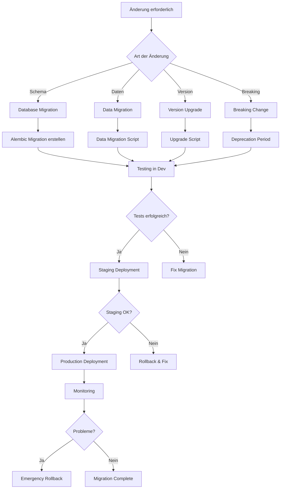

# Migration Guide

## Inhaltsverzeichnis

1. [Übersicht](#übersicht)
2. [Migrations-Strategie](#migrations-strategie)
3. [Database Migrations](#database-migrations)
4. [Version Upgrades](#version-upgrades)
5. [Rollback Procedures](#rollback-procedures)
6. [Data Migrations](#data-migrations)
7. [Breaking Changes](#breaking-changes)
8. [Zero-Downtime Migrations](#zero-downtime-migrations)
9. [Migration Testing](#migration-testing)
10. [API Migrations](#api-migrations)
11. [Frontend Migrations](#frontend-migrations)
12. [Infrastructure Migrations](#infrastructure-migrations)
13. [Best Practices](#best-practices)
14. [Troubleshooting](#troubleshooting)
15. [Appendix](#appendix)

---

## Übersicht

### Was sind Migrations?

Migrations sind kontrollierte Änderungen am System, die typischerweise folgende Bereiche betreffen:

- **Database Schema Migrations**: Strukturänderungen an der Datenbank
- **Data Migrations**: Datenumwandlungen und -migrationen
- **Version Upgrades**: Upgrade von einer Version zur nächsten
- **Breaking Changes**: Änderungen, die Kompatibilität brechen
- **Infrastructure Migrations**: Änderungen an der Infrastruktur

### Migrations-Prinzipien

**1. Versionskontrolle**
```python
# Jede Migration hat eine eindeutige Version
# Format: {timestamp}_{description}
# Beispiel: 20250117_add_ocr_backend_field.py
```

**2. Idempotenz**
```python
# Migrations müssen mehrfach ausführbar sein
# ohne Fehler oder Duplizierung
def upgrade():
    # Check if column already exists
    inspector = Inspector.from_engine(op.get_bind())
    columns = [col['name'] for col in inspector.get_columns('documents')]

    if 'ocr_backend' not in columns:
        op.add_column('documents', sa.Column('ocr_backend', sa.String(50)))
```

**3. Atomarität**
```python
# Migrations sollten in Transaktionen laufen
def upgrade():
    with op.get_context().begin_nested():
        # All operations in one transaction
        op.create_table(...)
        op.add_column(...)
        op.create_index(...)
```

**4. Reversibilität**
```python
# Jede Migration sollte ein Rollback haben
def upgrade():
    op.add_column('documents', sa.Column('new_field', sa.String(100)))

def downgrade():
    op.drop_column('documents', 'new_field')
```

### Migration Tools

**Alembic** (Database Migrations)
```bash
# Installation
pip install alembic

# Initialisierung
alembic init alembic

# Neue Migration erstellen
alembic revision --autogenerate -m "Add OCR backend field"

# Migration ausführen
alembic upgrade head

# Rollback
alembic downgrade -1
```

---

## Migrations-Strategie

### Migrations-Workflow



### Migration Types

**1. Schema Migrations**
```python
# backend/alembic/versions/20250117_add_confidence_score.py
"""Add confidence score to documents

Revision ID: a1b2c3d4e5f6
Revises: f6e5d4c3b2a1
Create Date: 2025-01-17 10:00:00.000000

"""
from alembic import op
import sqlalchemy as sa

# revision identifiers, used by Alembic.
revision = 'a1b2c3d4e5f6'
down_revision = 'f6e5d4c3b2a1'
branch_labels = None
depends_on = None

def upgrade():
    """Add confidence_score column to documents table."""
    op.add_column(
        'documents',
        sa.Column(
            'confidence_score',
            sa.Float,
            nullable=True,
            comment='OCR confidence score (0.0-1.0)'
        )
    )

    # Create index for filtering by confidence
    op.create_index(
        'ix_documents_confidence_score',
        'documents',
        ['confidence_score'],
        postgresql_where=sa.text('confidence_score IS NOT NULL')
    )

def downgrade():
    """Remove confidence_score column."""
    op.drop_index('ix_documents_confidence_score', table_name='documents')
    op.drop_column('documents', 'confidence_score')
```

**2. Data Migrations**
```python
# backend/alembic/versions/20250117_migrate_ocr_results.py
"""Migrate OCR results to new format

Revision ID: b2c3d4e5f6a7
Revises: a1b2c3d4e5f6
Create Date: 2025-01-17 11:00:00.000000

"""
from alembic import op
import sqlalchemy as sa
from sqlalchemy import text
import json

revision = 'b2c3d4e5f6a7'
down_revision = 'a1b2c3d4e5f6'
branch_labels = None
depends_on = None

def upgrade():
    """Migrate OCR results from old format to new format."""
    connection = op.get_bind()

    # Get all documents with old OCR format
    result = connection.execute(text("""
        SELECT id, ocr_result
        FROM documents
        WHERE ocr_result IS NOT NULL
        AND ocr_result::text LIKE '%old_format%'
    """))

    for row in result:
        doc_id = row[0]
        old_result = row[1]

        # Convert old format to new format
        new_result = convert_ocr_format(old_result)

        # Update document
        connection.execute(
            text("""
                UPDATE documents
                SET ocr_result = :new_result
                WHERE id = :doc_id
            """),
            {"new_result": json.dumps(new_result), "doc_id": doc_id}
        )

def downgrade():
    """Revert OCR results to old format."""
    connection = op.get_bind()

    result = connection.execute(text("""
        SELECT id, ocr_result
        FROM documents
        WHERE ocr_result IS NOT NULL
    """))

    for row in result:
        doc_id = row[0]
        new_result = row[1]

        # Convert back to old format
        old_result = revert_ocr_format(new_result)

        connection.execute(
            text("""
                UPDATE documents
                SET ocr_result = :old_result
                WHERE id = :doc_id
            """),
            {"old_result": json.dumps(old_result), "doc_id": doc_id}
        )

def convert_ocr_format(old_result):
    """Convert old OCR format to new format."""
    if isinstance(old_result, str):
        old_result = json.loads(old_result)

    return {
        "text": old_result.get("content", ""),
        "confidence": old_result.get("score", 0.0),
        "backend": old_result.get("engine", "unknown"),
        "metadata": {
            "language": old_result.get("lang", "de"),
            "pages": old_result.get("page_count", 1),
            "processing_time": old_result.get("duration", 0.0)
        },
        "blocks": extract_blocks(old_result)
    }

def revert_ocr_format(new_result):
    """Revert new OCR format to old format."""
    if isinstance(new_result, str):
        new_result = json.loads(new_result)

    return {
        "content": new_result.get("text", ""),
        "score": new_result.get("confidence", 0.0),
        "engine": new_result.get("backend", "unknown"),
        "lang": new_result.get("metadata", {}).get("language", "de"),
        "page_count": new_result.get("metadata", {}).get("pages", 1),
        "duration": new_result.get("metadata", {}).get("processing_time", 0.0)
    }

def extract_blocks(old_result):
    """Extract text blocks from old format."""
    blocks = []

    if "segments" in old_result:
        for segment in old_result["segments"]:
            blocks.append({
                "text": segment.get("text", ""),
                "bbox": segment.get("bbox", [0, 0, 0, 0]),
                "confidence": segment.get("conf", 0.0),
                "type": segment.get("type", "text")
            })

    return blocks
```

**3. Multi-Step Migrations**
```python
# backend/alembic/versions/20250117_refactor_user_roles.py
"""Refactor user roles system

This is a multi-step migration that:
1. Creates new role tables
2. Migrates existing role data
3. Updates foreign keys
4. Removes old role fields

Revision ID: c3d4e5f6a7b8
Revises: b2c3d4e5f6a7
Create Date: 2025-01-17 12:00:00.000000

"""
from alembic import op
import sqlalchemy as sa
from sqlalchemy.dialects import postgresql

revision = 'c3d4e5f6a7b8'
down_revision = 'b2c3d4e5f6a7'
branch_labels = None
depends_on = None

def upgrade():
    """Multi-step upgrade to new role system."""

    # Step 1: Create new roles table
    op.create_table(
        'roles',
        sa.Column('id', postgresql.UUID(as_uuid=True), primary_key=True),
        sa.Column('name', sa.String(50), nullable=False, unique=True),
        sa.Column('description', sa.Text),
        sa.Column('permissions', postgresql.JSONB, nullable=False, default={}),
        sa.Column('created_at', sa.TIMESTAMP, server_default=sa.func.now()),
        sa.Column('updated_at', sa.TIMESTAMP, server_default=sa.func.now())
    )

    # Step 2: Create user_roles junction table
    op.create_table(
        'user_roles',
        sa.Column('user_id', postgresql.UUID(as_uuid=True), nullable=False),
        sa.Column('role_id', postgresql.UUID(as_uuid=True), nullable=False),
        sa.Column('assigned_at', sa.TIMESTAMP, server_default=sa.func.now()),
        sa.Column('assigned_by', postgresql.UUID(as_uuid=True)),
        sa.ForeignKeyConstraint(['user_id'], ['users.id'], ondelete='CASCADE'),
        sa.ForeignKeyConstraint(['role_id'], ['roles.id'], ondelete='CASCADE'),
        sa.ForeignKeyConstraint(['assigned_by'], ['users.id']),
        sa.PrimaryKeyConstraint('user_id', 'role_id')
    )

    # Step 3: Insert default roles
    from sqlalchemy import text
    connection = op.get_bind()

    roles = [
        {
            'id': 'a1111111-1111-1111-1111-111111111111',
            'name': 'admin',
            'description': 'Administrator with full access',
            'permissions': json.dumps({
                'documents': ['create', 'read', 'update', 'delete'],
                'users': ['create', 'read', 'update', 'delete'],
                'settings': ['read', 'update'],
                'analytics': ['read']
            })
        },
        {
            'id': 'b2222222-2222-2222-2222-222222222222',
            'name': 'user',
            'description': 'Regular user with standard access',
            'permissions': json.dumps({
                'documents': ['create', 'read', 'update', 'delete'],
                'users': ['read'],
                'settings': ['read'],
                'analytics': ['read']
            })
        },
        {
            'id': 'c3333333-3333-3333-3333-333333333333',
            'name': 'viewer',
            'description': 'Read-only access',
            'permissions': json.dumps({
                'documents': ['read'],
                'users': [],
                'settings': ['read'],
                'analytics': ['read']
            })
        }
    ]

    for role in roles:
        connection.execute(text("""
            INSERT INTO roles (id, name, description, permissions)
            VALUES (:id, :name, :description, :permissions)
        """), role)

    # Step 4: Migrate existing user roles
    result = connection.execute(text("""
        SELECT id, role FROM users WHERE role IS NOT NULL
    """))

    for row in result:
        user_id = row[0]
        old_role = row[1]

        # Map old role to new role
        role_mapping = {
            'admin': 'a1111111-1111-1111-1111-111111111111',
            'user': 'b2222222-2222-2222-2222-222222222222',
            'viewer': 'c3333333-3333-3333-3333-333333333333'
        }

        new_role_id = role_mapping.get(old_role)

        if new_role_id:
            connection.execute(text("""
                INSERT INTO user_roles (user_id, role_id)
                VALUES (:user_id, :role_id)
            """), {"user_id": user_id, "role_id": new_role_id})

    # Step 5: Remove old role column (after verification)
    # This is commented out for safety - uncomment after verification
    # op.drop_column('users', 'role')

def downgrade():
    """Revert to old role system."""

    # Step 1: Add back old role column
    op.add_column('users', sa.Column('role', sa.String(20)))

    # Step 2: Migrate role data back
    from sqlalchemy import text
    connection = op.get_bind()

    result = connection.execute(text("""
        SELECT u.id, r.name
        FROM users u
        JOIN user_roles ur ON u.id = ur.user_id
        JOIN roles r ON ur.role_id = r.id
    """))

    for row in result:
        user_id = row[0]
        role_name = row[1]

        connection.execute(text("""
            UPDATE users SET role = :role WHERE id = :user_id
        """), {"role": role_name, "user_id": user_id})

    # Step 3: Drop new tables
    op.drop_table('user_roles')
    op.drop_table('roles')
```

---

## Database Migrations

### Alembic Setup

**1. Konfiguration**
```python
# backend/alembic.ini
[alembic]
script_location = alembic
prepend_sys_path = .
version_path_separator = os

sqlalchemy.url = postgresql://%(DB_USER)s:%(DB_PASSWORD)s@%(DB_HOST)s:%(DB_PORT)s/%(DB_NAME)s

[alembic:exclude]
# Tables to exclude from autogenerate
tables = spatial_ref_sys, alembic_version

[loggers]
keys = root,sqlalchemy,alembic

[handlers]
keys = console

[formatters]
keys = generic

[logger_root]
level = WARN
handlers = console

[logger_sqlalchemy]
level = WARN
handlers =
qualname = sqlalchemy.engine

[logger_alembic]
level = INFO
handlers =
qualname = alembic

[handler_console]
class = StreamHandler
args = (sys.stderr,)
level = NOTSET
formatter = generic

[formatter_generic]
format = %(levelname)-5.5s [%(name)s] %(message)s
datefmt = %H:%M:%S
```

**2. Environment Configuration**
```python
# backend/alembic/env.py
from logging.config import fileConfig
from sqlalchemy import engine_from_config
from sqlalchemy import pool
from alembic import context
import os
import sys

# Add backend to path
sys.path.insert(0, os.path.dirname(os.path.dirname(__file__)))

# Import all models for autogenerate
from backend.models import Base
from backend.models.user import User
from backend.models.document import Document
from backend.models.ocr_result import OCRResult
from backend.models.notification import NotificationEvent, NotificationDelivery
from backend.core.config import settings

# Alembic Config object
config = context.config

# Interpret the config file for Python logging
if config.config_file_name is not None:
    fileConfig(config.config_file_name)

# Set target metadata for autogenerate
target_metadata = Base.metadata

def get_url():
    """Get database URL from environment."""
    return str(settings.DATABASE_URL)

def run_migrations_offline():
    """Run migrations in 'offline' mode."""
    url = get_url()
    context.configure(
        url=url,
        target_metadata=target_metadata,
        literal_binds=True,
        dialect_opts={"paramstyle": "named"},
        compare_type=True,
        compare_server_default=True,
    )

    with context.begin_transaction():
        context.run_migrations()

def run_migrations_online():
    """Run migrations in 'online' mode."""
    configuration = config.get_section(config.config_ini_section)
    configuration["sqlalchemy.url"] = get_url()

    connectable = engine_from_config(
        configuration,
        prefix="sqlalchemy.",
        poolclass=pool.NullPool,
    )

    with connectable.connect() as connection:
        context.configure(
            connection=connection,
            target_metadata=target_metadata,
            compare_type=True,
            compare_server_default=True,
        )

        with context.begin_transaction():
            context.run_migrations()

if context.is_offline_mode():
    run_migrations_offline()
else:
    run_migrations_online()
```

### Common Migration Patterns

**1. Add Column**
```python
def upgrade():
    op.add_column(
        'documents',
        sa.Column('language', sa.String(10), nullable=True, default='de')
    )

def downgrade():
    op.drop_column('documents', 'language')
```

**2. Add Column with Default and Backfill**
```python
def upgrade():
    # Add column as nullable first
    op.add_column(
        'documents',
        sa.Column('status', sa.String(20), nullable=True)
    )

    # Backfill existing rows
    from sqlalchemy import text
    connection = op.get_bind()
    connection.execute(text("""
        UPDATE documents
        SET status = 'completed'
        WHERE status IS NULL AND ocr_result IS NOT NULL
    """))

    connection.execute(text("""
        UPDATE documents
        SET status = 'pending'
        WHERE status IS NULL
    """))

    # Make column non-nullable
    op.alter_column('documents', 'status', nullable=False)

def downgrade():
    op.drop_column('documents', 'status')
```

**3. Create Table**
```python
def upgrade():
    op.create_table(
        'document_tags',
        sa.Column('id', postgresql.UUID(as_uuid=True), primary_key=True),
        sa.Column('document_id', postgresql.UUID(as_uuid=True), nullable=False),
        sa.Column('tag', sa.String(100), nullable=False),
        sa.Column('created_at', sa.TIMESTAMP, server_default=sa.func.now()),
        sa.ForeignKeyConstraint(
            ['document_id'],
            ['documents.id'],
            ondelete='CASCADE'
        ),
        sa.UniqueConstraint('document_id', 'tag', name='uq_document_tag')
    )

    op.create_index(
        'ix_document_tags_tag',
        'document_tags',
        ['tag']
    )

def downgrade():
    op.drop_table('document_tags')
```

**4. Rename Column**
```python
def upgrade():
    op.alter_column('documents', 'ocr_text', new_column_name='extracted_text')

def downgrade():
    op.alter_column('documents', 'extracted_text', new_column_name='ocr_text')
```

**5. Change Column Type**
```python
def upgrade():
    # Change column type with data conversion
    op.alter_column(
        'documents',
        'confidence_score',
        type_=sa.Numeric(precision=5, scale=4),
        postgresql_using='confidence_score::numeric(5,4)'
    )

def downgrade():
    op.alter_column(
        'documents',
        'confidence_score',
        type_=sa.Float,
        postgresql_using='confidence_score::double precision'
    )
```

**6. Add Foreign Key**
```python
def upgrade():
    op.create_foreign_key(
        'fk_documents_user_id',
        'documents',
        'users',
        ['user_id'],
        ['id'],
        ondelete='CASCADE'
    )

def downgrade():
    op.drop_constraint('fk_documents_user_id', 'documents', type_='foreignkey')
```

**7. Add Index**
```python
def upgrade():
    # Simple index
    op.create_index('ix_documents_created_at', 'documents', ['created_at'])

    # Composite index
    op.create_index(
        'ix_documents_user_status',
        'documents',
        ['user_id', 'status']
    )

    # Partial index
    op.create_index(
        'ix_documents_pending',
        'documents',
        ['created_at'],
        postgresql_where=sa.text("status = 'pending'")
    )

    # GIN index for JSONB
    op.create_index(
        'ix_documents_metadata',
        'documents',
        ['metadata'],
        postgresql_using='gin'
    )

def downgrade():
    op.drop_index('ix_documents_created_at')
    op.drop_index('ix_documents_user_status')
    op.drop_index('ix_documents_pending')
    op.drop_index('ix_documents_metadata')
```

---

## Version Upgrades

### Upgrade Process

**Version Upgrade Checklist**

```markdown
# Version Upgrade Checklist

## Pre-Upgrade

- [ ] Read CHANGELOG for breaking changes
- [ ] Backup database
- [ ] Test upgrade in staging environment
- [ ] Notify users of planned downtime (if applicable)
- [ ] Check disk space (database, logs, cache)
- [ ] Verify all dependencies are compatible

## During Upgrade

- [ ] Stop application services
- [ ] Run database migrations
- [ ] Update application code
- [ ] Update configuration files
- [ ] Clear caches (Redis, application cache)
- [ ] Restart services in correct order

## Post-Upgrade

- [ ] Verify database migrations completed
- [ ] Run smoke tests
- [ ] Check application logs for errors
- [ ] Monitor performance metrics
- [ ] Verify all features working
- [ ] Document any issues encountered

## Rollback Plan

- [ ] Database backup location: __________
- [ ] Application backup location: __________
- [ ] Rollback script tested: Yes/No
- [ ] Estimated rollback time: __________
```

### Version-Specific Upgrade Guides

**v0.9 → v1.0**
```bash
#!/bin/bash
# scripts/upgrade_v0.9_to_v1.0.sh

set -e

echo "Starting upgrade from v0.9 to v1.0..."

# Step 1: Backup
echo "Creating backup..."
./scripts/backup.sh

# Step 2: Stop services
echo "Stopping services..."
docker-compose down

# Step 3: Pull new images
echo "Pulling new Docker images..."
docker-compose pull

# Step 4: Run database migrations
echo "Running database migrations..."
docker-compose run --rm backend alembic upgrade head

# Step 5: Data migrations
echo "Running data migrations..."
docker-compose run --rm backend python scripts/migrate_data_v1.0.py

# Step 6: Update configuration
echo "Updating configuration..."
if [ ! -f ".env.v1.0" ]; then
    echo "ERROR: .env.v1.0 not found. Please create it from .env.example"
    exit 1
fi

cp .env .env.v0.9.backup
cp .env.v1.0 .env

# Step 7: Clear caches
echo "Clearing caches..."
docker-compose run --rm backend python scripts/clear_cache.py

# Step 8: Start services
echo "Starting services..."
docker-compose up -d

# Step 9: Verify upgrade
echo "Verifying upgrade..."
sleep 10

# Check health endpoints
if curl -f http://localhost:8000/health > /dev/null 2>&1; then
    echo "✓ Backend is healthy"
else
    echo "✗ Backend health check failed"
    exit 1
fi

if curl -f http://localhost:3000 > /dev/null 2>&1; then
    echo "✓ Frontend is healthy"
else
    echo "✗ Frontend health check failed"
    exit 1
fi

# Step 10: Run smoke tests
echo "Running smoke tests..."
docker-compose run --rm backend pytest tests/smoke/

echo "Upgrade completed successfully!"
echo ""
echo "IMPORTANT: Review the following:"
echo "- Check logs: docker-compose logs -f"
echo "- Monitor metrics: http://localhost:3000/admin/metrics"
echo "- Test critical features manually"
```

**Data Migration Script**
```python
# scripts/migrate_data_v1.0.py
"""
Data migration script for v1.0

Changes:
- Migrate OCR results to new format
- Update user roles to new permission system
- Convert old tags to new taxonomy
"""
import asyncio
import logging
from sqlalchemy import create_engine, text
from sqlalchemy.orm import sessionmaker
import json

from backend.core.config import settings

logging.basicConfig(level=logging.INFO)
logger = logging.getLogger(__name__)

engine = create_engine(str(settings.DATABASE_URL))
SessionLocal = sessionmaker(bind=engine)

async def migrate_ocr_results():
    """Migrate OCR results to new format."""
    logger.info("Migrating OCR results...")

    db = SessionLocal()
    try:
        # Get all documents with old OCR format
        result = db.execute(text("""
            SELECT id, ocr_result
            FROM documents
            WHERE ocr_result IS NOT NULL
            AND NOT (ocr_result ? 'version')
        """))

        count = 0
        for row in result:
            doc_id = row[0]
            old_result = row[1]

            # Convert to new format
            new_result = {
                "version": "1.0",
                "text": old_result.get("content", ""),
                "confidence": old_result.get("score", 0.0),
                "backend": old_result.get("engine", "unknown"),
                "metadata": {
                    "language": old_result.get("lang", "de"),
                    "pages": old_result.get("page_count", 1),
                    "processing_time": old_result.get("duration", 0.0)
                },
                "blocks": extract_blocks(old_result)
            }

            # Update document
            db.execute(
                text("""
                    UPDATE documents
                    SET ocr_result = :new_result,
                        updated_at = NOW()
                    WHERE id = :doc_id
                """),
                {"new_result": json.dumps(new_result), "doc_id": doc_id}
            )

            count += 1
            if count % 100 == 0:
                logger.info(f"Migrated {count} OCR results...")
                db.commit()

        db.commit()
        logger.info(f"Migrated {count} OCR results total")

    finally:
        db.close()

async def migrate_user_roles():
    """Migrate user roles to new permission system."""
    logger.info("Migrating user roles...")

    db = SessionLocal()
    try:
        # This assumes the role tables already exist from schema migration

        # Get users without role assignments
        result = db.execute(text("""
            SELECT u.id
            FROM users u
            LEFT JOIN user_roles ur ON u.id = ur.user_id
            WHERE ur.user_id IS NULL
        """))

        count = 0
        for row in result:
            user_id = row[0]

            # Assign default 'user' role
            db.execute(
                text("""
                    INSERT INTO user_roles (user_id, role_id)
                    VALUES (
                        :user_id,
                        (SELECT id FROM roles WHERE name = 'user' LIMIT 1)
                    )
                """),
                {"user_id": user_id}
            )

            count += 1

        db.commit()
        logger.info(f"Assigned default roles to {count} users")

    finally:
        db.close()

async def migrate_tags():
    """Migrate old tags to new taxonomy."""
    logger.info("Migrating tags...")

    db = SessionLocal()
    try:
        # Tag mapping from old to new
        tag_mapping = {
            "invoice": "financial:invoice",
            "receipt": "financial:receipt",
            "contract": "legal:contract",
            "id": "identity:id-card",
            "passport": "identity:passport",
            "letter": "communication:letter",
            "email": "communication:email"
        }

        for old_tag, new_tag in tag_mapping.items():
            db.execute(
                text("""
                    UPDATE document_tags
                    SET tag = :new_tag
                    WHERE tag = :old_tag
                """),
                {"old_tag": old_tag, "new_tag": new_tag}
            )

        db.commit()
        logger.info("Tag migration completed")

    finally:
        db.close()

def extract_blocks(old_result):
    """Extract text blocks from old OCR format."""
    blocks = []

    if "segments" in old_result:
        for segment in old_result["segments"]:
            blocks.append({
                "text": segment.get("text", ""),
                "bbox": segment.get("bbox", [0, 0, 0, 0]),
                "confidence": segment.get("conf", 0.0),
                "type": segment.get("type", "text")
            })

    return blocks

async def main():
    """Run all migrations."""
    logger.info("Starting v1.0 data migration...")

    try:
        await migrate_ocr_results()
        await migrate_user_roles()
        await migrate_tags()

        logger.info("All migrations completed successfully!")

    except Exception as e:
        logger.error(f"Migration failed: {e}", exc_info=True)
        raise

if __name__ == "__main__":
    asyncio.run(main())
```

---

## Rollback Procedures

### Automatic Rollback

**Database Rollback**
```bash
#!/bin/bash
# scripts/rollback_database.sh

set -e

# Get current database version
CURRENT_VERSION=$(docker-compose exec -T postgres psql -U ablage -d ablage -t -c \
    "SELECT version_num FROM alembic_version LIMIT 1" | xargs)

echo "Current database version: $CURRENT_VERSION"

# Get target version (one step back)
read -p "Enter target version (or press Enter to rollback one step): " TARGET_VERSION

if [ -z "$TARGET_VERSION" ]; then
    echo "Rolling back one migration step..."
    docker-compose run --rm backend alembic downgrade -1
else
    echo "Rolling back to version: $TARGET_VERSION"
    docker-compose run --rm backend alembic downgrade $TARGET_VERSION
fi

# Verify rollback
NEW_VERSION=$(docker-compose exec -T postgres psql -U ablage -d ablage -t -c \
    "SELECT version_num FROM alembic_version LIMIT 1" | xargs)

echo "New database version: $NEW_VERSION"
```

**Application Rollback**
```bash
#!/bin/bash
# scripts/rollback_application.sh

set -e

read -p "Enter version to rollback to (e.g., v0.9.5): " VERSION

if [ -z "$VERSION" ]; then
    echo "ERROR: Version required"
    exit 1
fi

echo "Rolling back to version $VERSION..."

# Step 1: Stop services
echo "Stopping services..."
docker-compose down

# Step 2: Checkout code version
echo "Checking out code version $VERSION..."
git checkout $VERSION

# Step 3: Rollback database if needed
read -p "Rollback database? (y/n): " ROLLBACK_DB

if [ "$ROLLBACK_DB" = "y" ]; then
    ./scripts/rollback_database.sh
fi

# Step 4: Restore configuration
if [ -f ".env.$VERSION" ]; then
    echo "Restoring configuration for $VERSION..."
    cp .env ".env.backup.$(date +%Y%m%d_%H%M%S)"
    cp ".env.$VERSION" .env
fi

# Step 5: Pull old Docker images
echo "Pulling Docker images for $VERSION..."
docker-compose pull

# Step 6: Start services
echo "Starting services..."
docker-compose up -d

# Step 7: Verify
echo "Verifying rollback..."
sleep 10

if curl -f http://localhost:8000/health > /dev/null 2>&1; then
    echo "✓ Rollback successful"
else
    echo "✗ Rollback verification failed"
    exit 1
fi

echo "Rollback to $VERSION completed!"
```

### Manual Rollback

**Step-by-Step Manual Rollback**

1. **Stop all services**
```bash
docker-compose down
```

2. **Restore database from backup**
```bash
# List available backups
ls -lh /backups/postgres/

# Restore from specific backup
pg_restore -U ablage -d ablage -c /backups/postgres/ablage_20250117_100000.dump
```

3. **Checkout previous version**
```bash
git checkout v0.9.5
```

4. **Restore configuration**
```bash
cp .env.v0.9.5 .env
```

5. **Start services**
```bash
docker-compose up -d
```

6. **Verify**
```bash
curl http://localhost:8000/health
docker-compose logs -f
```

---

## Data Migrations

### Large Data Migrations

**Batch Processing**
```python
# scripts/batch_migrate_documents.py
"""
Batch migration script for large datasets.

Processes documents in batches to avoid memory issues.
"""
import logging
from sqlalchemy import create_engine, text
from sqlalchemy.orm import sessionmaker
import time

from backend.core.config import settings

logging.basicConfig(level=logging.INFO)
logger = logging.getLogger(__name__)

BATCH_SIZE = 1000

def migrate_documents():
    """Migrate documents in batches."""
    engine = create_engine(str(settings.DATABASE_URL))
    SessionLocal = sessionmaker(bind=engine)

    db = SessionLocal()
    try:
        # Get total count
        result = db.execute(text("""
            SELECT COUNT(*)
            FROM documents
            WHERE needs_migration = true
        """))
        total = result.scalar()

        logger.info(f"Total documents to migrate: {total}")

        offset = 0
        migrated = 0

        while offset < total:
            start_time = time.time()

            # Get batch
            result = db.execute(text("""
                SELECT id, data
                FROM documents
                WHERE needs_migration = true
                ORDER BY id
                LIMIT :limit OFFSET :offset
            """), {"limit": BATCH_SIZE, "offset": offset})

            batch = result.fetchall()

            if not batch:
                break

            # Process batch
            for row in batch:
                doc_id = row[0]
                data = row[1]

                # Transform data
                new_data = transform_data(data)

                # Update document
                db.execute(text("""
                    UPDATE documents
                    SET data = :new_data,
                        needs_migration = false,
                        updated_at = NOW()
                    WHERE id = :doc_id
                """), {"new_data": new_data, "doc_id": doc_id})

            db.commit()

            migrated += len(batch)
            offset += BATCH_SIZE

            elapsed = time.time() - start_time
            rate = len(batch) / elapsed
            remaining = (total - migrated) / rate if rate > 0 else 0

            logger.info(
                f"Migrated {migrated}/{total} documents "
                f"({migrated/total*100:.1f}%) "
                f"- Rate: {rate:.1f} docs/sec "
                f"- ETA: {remaining/60:.1f} minutes"
            )

        logger.info(f"Migration completed! Migrated {migrated} documents")

    finally:
        db.close()

def transform_data(data):
    """Transform data to new format."""
    # Implementation specific to your data
    return {
        "version": "1.0",
        **data
    }

if __name__ == "__main__":
    migrate_documents()
```

**Parallel Processing**
```python
# scripts/parallel_migrate.py
"""
Parallel data migration using multiprocessing.
"""
import logging
from multiprocessing import Pool, cpu_count
from sqlalchemy import create_engine, text
from sqlalchemy.orm import sessionmaker

from backend.core.config import settings

logging.basicConfig(level=logging.INFO)
logger = logging.getLogger(__name__)

def migrate_batch(batch_info):
    """Migrate a single batch (worker function)."""
    offset, limit = batch_info

    engine = create_engine(str(settings.DATABASE_URL))
    SessionLocal = sessionmaker(bind=engine)
    db = SessionLocal()

    try:
        result = db.execute(text("""
            SELECT id, data
            FROM documents
            WHERE needs_migration = true
            ORDER BY id
            LIMIT :limit OFFSET :offset
        """), {"limit": limit, "offset": offset})

        count = 0
        for row in result:
            doc_id = row[0]
            data = row[1]

            new_data = transform_data(data)

            db.execute(text("""
                UPDATE documents
                SET data = :new_data,
                    needs_migration = false
                WHERE id = :doc_id
            """), {"new_data": new_data, "doc_id": doc_id})

            count += 1

        db.commit()
        return count

    finally:
        db.close()

def main():
    """Run parallel migration."""
    engine = create_engine(str(settings.DATABASE_URL))
    SessionLocal = sessionmaker(bind=engine)
    db = SessionLocal()

    # Get total count
    result = db.execute(text("""
        SELECT COUNT(*) FROM documents WHERE needs_migration = true
    """))
    total = result.scalar()
    db.close()

    logger.info(f"Total documents to migrate: {total}")

    # Create batches
    batch_size = 1000
    num_workers = cpu_count()

    batches = [
        (offset, batch_size)
        for offset in range(0, total, batch_size)
    ]

    logger.info(f"Processing with {num_workers} workers...")

    # Process in parallel
    with Pool(num_workers) as pool:
        results = pool.map(migrate_batch, batches)

    total_migrated = sum(results)
    logger.info(f"Migration completed! Migrated {total_migrated} documents")

def transform_data(data):
    """Transform data to new format."""
    return {
        "version": "1.0",
        **data
    }

if __name__ == "__main__":
    main()
```

---

## Breaking Changes

### Deprecation Process

**Phase 1: Announce (Version N)**
```python
# backend/api/v1/documents.py
import warnings

@router.get("/{document_id}/ocr-text")
async def get_ocr_text(document_id: str):
    """
    Get OCR text for a document.

    **DEPRECATED**: This endpoint is deprecated and will be removed in v2.0.
    Use GET /documents/{document_id}/extracted-text instead.
    """
    warnings.warn(
        "GET /documents/{id}/ocr-text is deprecated. "
        "Use GET /documents/{id}/extracted-text instead.",
        DeprecationWarning,
        stacklevel=2
    )

    # Add deprecation header
    response.headers["X-API-Deprecation"] = (
        "This endpoint is deprecated and will be removed in v2.0. "
        "Use GET /documents/{id}/extracted-text instead."
    )

    # Existing implementation
    ...
```

**Phase 2: Maintain Both (Version N+1)**
```python
# backend/api/v1/documents.py

@router.get("/{document_id}/ocr-text")
@router.get("/{document_id}/extracted-text")
async def get_extracted_text(
    document_id: str,
    request: Request
):
    """Get extracted text for a document."""

    # Check if using deprecated endpoint
    if "/ocr-text" in str(request.url):
        warnings.warn(
            "GET /documents/{id}/ocr-text is deprecated and will be removed in v2.0",
            DeprecationWarning
        )
        response.headers["X-API-Deprecation"] = "true"

        # Log usage for monitoring
        logger.warning(
            f"Deprecated endpoint used: {request.url}",
            extra={"user_id": request.user.id}
        )

    # Implementation
    ...
```

**Phase 3: Remove (Version N+2)**
```python
# backend/api/v2/documents.py

@router.get("/{document_id}/extracted-text")
async def get_extracted_text(document_id: str):
    """Get extracted text for a document."""
    # Only new endpoint exists
    ...
```

### Migration Guide for Breaking Changes

```markdown
# Breaking Changes Migration Guide - v1.0 to v2.0

## API Endpoint Changes

### Document OCR Text Endpoint

**Old** (Removed in v2.0):
\`\`\`http
GET /api/v1/documents/{id}/ocr-text
\`\`\`

**New**:
\`\`\`http
GET /api/v2/documents/{id}/extracted-text
\`\`\`

**Migration**:
\`\`\`python
# Before
response = requests.get(f"{base_url}/api/v1/documents/{doc_id}/ocr-text")
text = response.json()["text"]

# After
response = requests.get(f"{base_url}/api/v2/documents/{doc_id}/extracted-text")
text = response.json()["text"]
\`\`\`

## Response Format Changes

### OCR Result Format

**Old**:
\`\`\`json
{
  "content": "text content",
  "score": 0.95,
  "engine": "deepseek"
}
\`\`\`

**New**:
\`\`\`json
{
  "version": "2.0",
  "text": "text content",
  "confidence": 0.95,
  "backend": "deepseek",
  "metadata": {
    "language": "de",
    "pages": 1
  },
  "blocks": []
}
\`\`\`

**Migration**:
\`\`\`python
# Before
text = ocr_result["content"]
confidence = ocr_result["score"]
backend = ocr_result["engine"]

# After
text = ocr_result["text"]
confidence = ocr_result["confidence"]
backend = ocr_result["backend"]
\`\`\`

## Configuration Changes

### Environment Variables

**Renamed**:
- `OCR_ENGINE` → `OCR_BACKEND`
- `MAX_FILE_SIZE` → `MAX_UPLOAD_SIZE_MB`
- `REDIS_URL` → `REDIS_DSN`

**Removed**:
- `LEGACY_MODE` (no longer supported)
- `OLD_API_ENABLED` (v1 API removed)

**Added**:
- `OCR_TIMEOUT_SECONDS` (default: 300)
- `ENABLE_WEBHOOKS` (default: true)

### Database

**Schema Changes**:
- Table `ocr_results` merged into `documents`
- Column `documents.ocr_text` renamed to `extracted_text`
- Column `documents.confidence_score` type changed to `DECIMAL(5,4)`

## Code Changes

### Python SDK

**Before**:
\`\`\`python
from ablage_client import AblageClient

client = AblageClient(api_key="...")
document = client.documents.get(doc_id)
text = document.ocr_text
\`\`\`

**After**:
\`\`\`python
from ablage_sdk import AblageSDK

sdk = AblageSDK(api_key="...")
document = sdk.documents.get(doc_id)
text = document.extracted_text
\`\`\`

### TypeScript SDK

**Before**:
\`\`\`typescript
import { AblageClient } from '@ablage/client';

const client = new AblageClient({ apiKey: '...' });
const document = await client.documents.get(docId);
const text = document.ocrText;
\`\`\`

**After**:
\`\`\`typescript
import { AblageSDK } from '@ablage/sdk';

const sdk = new AblageSDK({ apiKey: '...' });
const document = await sdk.documents.get(docId);
const text = document.extractedText;
\`\`\`
```

---

## Zero-Downtime Migrations

### Blue-Green Deployment

```bash
#!/bin/bash
# scripts/blue_green_deploy.sh

set -e

BLUE_ENV="production"
GREEN_ENV="production-green"

echo "Starting blue-green deployment..."

# Step 1: Deploy to green environment
echo "Deploying to green environment..."
docker-compose -p $GREEN_ENV up -d

# Step 2: Wait for health check
echo "Waiting for green environment to be healthy..."
for i in {1..30}; do
    if curl -f http://localhost:8001/health > /dev/null 2>&1; then
        echo "✓ Green environment is healthy"
        break
    fi

    if [ $i -eq 30 ]; then
        echo "✗ Green environment failed to become healthy"
        docker-compose -p $GREEN_ENV down
        exit 1
    fi

    sleep 2
done

# Step 3: Run smoke tests on green
echo "Running smoke tests on green environment..."
docker-compose -p $GREEN_ENV run --rm backend pytest tests/smoke/

# Step 4: Switch traffic to green
echo "Switching traffic to green..."
# Update load balancer configuration
# (Implementation depends on your load balancer)

# Step 5: Monitor green environment
echo "Monitoring green environment for 5 minutes..."
sleep 300

# Step 6: Check for errors
ERROR_COUNT=$(docker-compose -p $GREEN_ENV logs backend | grep -c ERROR || true)

if [ $ERROR_COUNT -gt 10 ]; then
    echo "✗ Too many errors detected. Rolling back..."
    # Switch traffic back to blue
    docker-compose -p $BLUE_ENV up -d
    docker-compose -p $GREEN_ENV down
    exit 1
fi

# Step 7: Shutdown blue environment
echo "Shutting down blue environment..."
docker-compose -p $BLUE_ENV down

echo "✓ Blue-green deployment completed successfully!"
```

### Expand-Contract Pattern

**Phase 1: Expand**
```python
# Add new column while keeping old one
def upgrade():
    # Add new column
    op.add_column('documents', sa.Column('extracted_text', sa.Text))

    # Copy data from old column to new column
    from sqlalchemy import text
    connection = op.get_bind()
    connection.execute(text("""
        UPDATE documents
        SET extracted_text = ocr_text
        WHERE ocr_text IS NOT NULL
    """))
```

**Phase 2: Migrate Application Code**
```python
# backend/models/document.py
class Document(Base):
    __tablename__ = "documents"

    # Both columns exist during migration
    ocr_text = Column(Text)  # Old column
    extracted_text = Column(Text)  # New column

    @property
    def text_content(self):
        """Get text content (supports both old and new column)."""
        return self.extracted_text or self.ocr_text

    def set_text_content(self, text: str):
        """Set text content (writes to both columns during migration)."""
        self.ocr_text = text
        self.extracted_text = text
```

**Phase 3: Contract**
```python
# Remove old column after all code migrated
def upgrade():
    # Verify all data copied
    from sqlalchemy import text
    connection = op.get_bind()

    result = connection.execute(text("""
        SELECT COUNT(*)
        FROM documents
        WHERE ocr_text IS NOT NULL
        AND extracted_text IS NULL
    """))

    count = result.scalar()
    if count > 0:
        raise Exception(f"{count} documents have ocr_text but not extracted_text")

    # Drop old column
    op.drop_column('documents', 'ocr_text')
```

### Rolling Deployment

```yaml
# docker-compose.rolling.yml
version: '3.8'

services:
  backend:
    image: ablage/backend:${VERSION}
    deploy:
      replicas: 4
      update_config:
        parallelism: 1  # Update one container at a time
        delay: 30s  # Wait 30s between updates
        failure_action: rollback
        monitor: 60s  # Monitor for 60s after update
      rollback_config:
        parallelism: 1
        delay: 10s
```

```bash
# Deploy with rolling update
docker stack deploy -c docker-compose.rolling.yml ablage
```

---

## Migration Testing

### Test Migration Scripts

```python
# tests/migrations/test_migrations.py
"""
Test migration scripts.
"""
import pytest
from alembic import command
from alembic.config import Config
from sqlalchemy import create_engine, text
from sqlalchemy.orm import sessionmaker

from backend.core.config import settings

@pytest.fixture
def alembic_config():
    """Create Alembic configuration."""
    config = Config("alembic.ini")
    config.set_main_option("sqlalchemy.url", str(settings.DATABASE_URL))
    return config

@pytest.fixture
def db_session():
    """Create database session."""
    engine = create_engine(str(settings.DATABASE_URL))
    SessionLocal = sessionmaker(bind=engine)
    session = SessionLocal()
    yield session
    session.close()

def test_upgrade_downgrade(alembic_config, db_session):
    """Test that migrations can upgrade and downgrade."""
    # Upgrade to head
    command.upgrade(alembic_config, "head")

    # Verify migration completed
    result = db_session.execute(text("""
        SELECT version_num FROM alembic_version LIMIT 1
    """))
    version = result.scalar()
    assert version is not None

    # Downgrade one step
    command.downgrade(alembic_config, "-1")

    # Upgrade again
    command.upgrade(alembic_config, "head")

def test_migration_idempotency(alembic_config):
    """Test that migrations are idempotent."""
    # Run upgrade twice
    command.upgrade(alembic_config, "head")
    command.upgrade(alembic_config, "head")  # Should not fail

def test_data_migration(db_session):
    """Test data migration preserves data integrity."""
    # Insert test data in old format
    db_session.execute(text("""
        INSERT INTO documents (id, ocr_result)
        VALUES (
            'test-doc-1',
            '{"content": "test", "score": 0.95}'::jsonb
        )
    """))
    db_session.commit()

    # Run migration (this would be done via alembic)
    # ...

    # Verify data migrated correctly
    result = db_session.execute(text("""
        SELECT ocr_result FROM documents WHERE id = 'test-doc-1'
    """))
    row = result.fetchone()

    assert row is not None
    ocr_result = row[0]
    assert ocr_result["version"] == "1.0"
    assert ocr_result["text"] == "test"
    assert ocr_result["confidence"] == 0.95

def test_migration_rollback(alembic_config, db_session):
    """Test that rollback preserves data."""
    # Create test data
    db_session.execute(text("""
        INSERT INTO documents (id, extracted_text)
        VALUES ('test-doc-2', 'test content')
    """))
    db_session.commit()

    # Get current version
    result = db_session.execute(text("""
        SELECT version_num FROM alembic_version LIMIT 1
    """))
    current_version = result.scalar()

    # Downgrade
    command.downgrade(alembic_config, "-1")

    # Verify data still exists
    result = db_session.execute(text("""
        SELECT COUNT(*) FROM documents WHERE id = 'test-doc-2'
    """))
    count = result.scalar()
    assert count == 1

    # Upgrade back
    command.upgrade(alembic_config, current_version)
```

### Integration Tests

```python
# tests/integration/test_version_upgrade.py
"""
Integration tests for version upgrades.
"""
import pytest
import requests
from typing import Dict

@pytest.fixture
def api_client():
    """Create API client."""
    return requests.Session()

def test_backward_compatibility(api_client):
    """Test that new version maintains backward compatibility."""
    base_url = "http://localhost:8000"

    # Test old endpoint still works (if in deprecation period)
    response = api_client.get(f"{base_url}/api/v1/documents/test/ocr-text")
    assert response.status_code == 200
    assert "X-API-Deprecation" in response.headers

    # Test new endpoint works
    response = api_client.get(f"{base_url}/api/v2/documents/test/extracted-text")
    assert response.status_code == 200

def test_data_format_compatibility(api_client):
    """Test that old data format is handled correctly."""
    # Upload document
    with open("test_document.pdf", "rb") as f:
        response = api_client.post(
            "http://localhost:8000/api/v2/documents/upload",
            files={"file": f}
        )

    assert response.status_code == 201
    doc_id = response.json()["id"]

    # Wait for processing
    import time
    time.sleep(5)

    # Get document
    response = api_client.get(f"http://localhost:8000/api/v2/documents/{doc_id}")
    assert response.status_code == 200

    data = response.json()

    # Verify new format
    assert "extracted_text" in data
    assert "ocr_result" in data
    assert data["ocr_result"]["version"] == "2.0"

@pytest.mark.performance
def test_migration_performance():
    """Test that migration doesn't degrade performance."""
    # Benchmark queries before migration
    # ...

    # Run migration
    # ...

    # Benchmark queries after migration
    # ...

    # Assert performance within acceptable range
    # ...
```

---

## API Migrations

### Versioning Strategy

**URL Versioning**
```python
# backend/main.py
from fastapi import FastAPI

app = FastAPI()

# Include v1 API
from backend.api.v1 import router as v1_router
app.include_router(v1_router, prefix="/api/v1")

# Include v2 API
from backend.api.v2 import router as v2_router
app.include_router(v2_router, prefix="/api/v2")
```

**Header Versioning**
```python
# backend/api/dependencies.py
from fastapi import Header, HTTPException

async def get_api_version(
    x_api_version: str = Header(default="1.0")
) -> str:
    """Get API version from header."""
    if x_api_version not in ["1.0", "2.0"]:
        raise HTTPException(
            status_code=400,
            detail=f"Unsupported API version: {x_api_version}"
        )
    return x_api_version

# backend/api/documents.py
@router.get("/{document_id}")
async def get_document(
    document_id: str,
    api_version: str = Depends(get_api_version)
):
    """Get document (version-aware)."""
    if api_version == "1.0":
        return get_document_v1(document_id)
    else:
        return get_document_v2(document_id)
```

### Response Transformation

```python
# backend/api/transformers.py
from typing import Dict, Any

class ResponseTransformer:
    """Transform responses between API versions."""

    @staticmethod
    def to_v1(document: Dict[str, Any]) -> Dict[str, Any]:
        """Transform document to v1 format."""
        return {
            "id": document["id"],
            "filename": document["filename"],
            "ocr_text": document.get("extracted_text", ""),
            "ocr_result": {
                "content": document.get("extracted_text", ""),
                "score": document.get("confidence_score", 0.0),
                "engine": document.get("ocr_backend", "unknown")
            },
            "created_at": document["created_at"],
            "updated_at": document["updated_at"]
        }

    @staticmethod
    def to_v2(document: Dict[str, Any]) -> Dict[str, Any]:
        """Transform document to v2 format."""
        return {
            "id": document["id"],
            "filename": document["filename"],
            "extracted_text": document.get("extracted_text", ""),
            "ocr_result": {
                "version": "2.0",
                "text": document.get("extracted_text", ""),
                "confidence": document.get("confidence_score", 0.0),
                "backend": document.get("ocr_backend", "unknown"),
                "metadata": document.get("metadata", {})
            },
            "created_at": document["created_at"],
            "updated_at": document["updated_at"]
        }

# Usage
@router.get("/{document_id}")
async def get_document(
    document_id: str,
    api_version: str = Depends(get_api_version)
):
    """Get document."""
    document = await document_service.get(document_id)

    if api_version == "1.0":
        return ResponseTransformer.to_v1(document)
    else:
        return ResponseTransformer.to_v2(document)
```

---

## Frontend Migrations

### Component Migration

```typescript
// frontend/src/components/Document/DocumentCard.tsx (v1)
interface DocumentCardProps {
  document: {
    id: string;
    filename: string;
    ocrText: string;  // Old property
    createdAt: string;
  };
}

export const DocumentCard: React.FC<DocumentCardProps> = ({ document }) => {
  return (
    <div className="document-card">
      <h3>{document.filename}</h3>
      <p>{document.ocrText}</p>
    </div>
  );
};
```

```typescript
// frontend/src/components/Document/DocumentCard.tsx (v2 - with backward compatibility)
interface DocumentCardProps {
  document: {
    id: string;
    filename: string;
    extractedText?: string;  // New property
    ocrText?: string;  // Deprecated, kept for compatibility
    createdAt: string;
  };
}

export const DocumentCard: React.FC<DocumentCardProps> = ({ document }) => {
  // Support both old and new property names
  const text = document.extractedText || document.ocrText || '';

  // Warn if using deprecated property
  if (process.env.NODE_ENV === 'development' && document.ocrText) {
    console.warn(
      'DocumentCard: ocrText property is deprecated. Use extractedText instead.'
    );
  }

  return (
    <div className="document-card">
      <h3>{document.filename}</h3>
      <p>{text}</p>
    </div>
  );
};
```

### Store Migration

```typescript
// frontend/src/stores/documentStore.ts
import create from 'zustand';
import { persist } from 'zustand/middleware';

interface DocumentState {
  documents: Document[];
  // ... other state
}

// Migration function for persisted state
const migrations = {
  0: (state: any) => state,  // Initial version

  1: (state: any) => {
    // Migrate v0 to v1: rename ocrText to extractedText
    return {
      ...state,
      documents: state.documents.map((doc: any) => ({
        ...doc,
        extractedText: doc.ocrText,
        ocrText: undefined
      }))
    };
  },

  2: (state: any) => {
    // Migrate v1 to v2: change OCR result format
    return {
      ...state,
      documents: state.documents.map((doc: any) => ({
        ...doc,
        ocrResult: {
          version: '2.0',
          text: doc.extractedText,
          confidence: doc.ocrResult?.score || 0.0,
          backend: doc.ocrResult?.engine || 'unknown'
        }
      }))
    };
  }
};

export const useDocumentStore = create(
  persist<DocumentState>(
    (set, get) => ({
      documents: [],
      // ... store implementation
    }),
    {
      name: 'document-storage',
      version: 2,
      migrate: (persistedState: any, version: number) => {
        let state = persistedState;

        // Apply all migrations from stored version to current
        for (let i = version; i < 2; i++) {
          state = migrations[i + 1](state);
        }

        return state;
      }
    }
  )
);
```

---

## Infrastructure Migrations

### Docker Image Migration

```bash
#!/bin/bash
# scripts/migrate_docker_images.sh

set -e

OLD_IMAGE="ablage/backend:v0.9"
NEW_IMAGE="ablage/backend:v1.0"

echo "Migrating from $OLD_IMAGE to $NEW_IMAGE..."

# Step 1: Pull new image
echo "Pulling new image..."
docker pull $NEW_IMAGE

# Step 2: Tag old image as backup
echo "Tagging old image as backup..."
docker tag $OLD_IMAGE "${OLD_IMAGE}-backup"

# Step 3: Update docker-compose.yml
echo "Updating docker-compose.yml..."
sed -i.backup "s|image: $OLD_IMAGE|image: $NEW_IMAGE|g" docker-compose.yml

# Step 4: Restart services with new image
echo "Restarting services..."
docker-compose up -d

# Step 5: Verify
echo "Verifying new image..."
sleep 10

if docker ps | grep -q "ablage/backend:v1.0"; then
    echo "✓ Migration successful"

    # Clean up old images after 7 days
    echo "Note: Old images will be cleaned up automatically after 7 days"
else
    echo "✗ Migration failed"

    # Rollback
    echo "Rolling back to old image..."
    mv docker-compose.yml.backup docker-compose.yml
    docker-compose up -d

    exit 1
fi
```

### Kubernetes Migration

```yaml
# k8s/backend-deployment.yaml
apiVersion: apps/v1
kind: Deployment
metadata:
  name: ablage-backend
spec:
  replicas: 3
  strategy:
    type: RollingUpdate
    rollingUpdate:
      maxSurge: 1
      maxUnavailable: 0
  selector:
    matchLabels:
      app: ablage-backend
  template:
    metadata:
      labels:
        app: ablage-backend
        version: v1.0
    spec:
      initContainers:
      - name: migration
        image: ablage/backend:v1.0
        command: ["alembic", "upgrade", "head"]
        env:
        - name: DATABASE_URL
          valueFrom:
            secretKeyRef:
              name: ablage-secrets
              key: database-url

      containers:
      - name: backend
        image: ablage/backend:v1.0
        ports:
        - containerPort: 8000
        env:
        - name: DATABASE_URL
          valueFrom:
            secretKeyRef:
              name: ablage-secrets
              key: database-url

        livenessProbe:
          httpGet:
            path: /health
            port: 8000
          initialDelaySeconds: 30
          periodSeconds: 10

        readinessProbe:
          httpGet:
            path: /health/ready
            port: 8000
          initialDelaySeconds: 10
          periodSeconds: 5
```

```bash
# Deploy with kubectl
kubectl apply -f k8s/backend-deployment.yaml

# Monitor rollout
kubectl rollout status deployment/ablage-backend

# If issues occur, rollback
kubectl rollout undo deployment/ablage-backend
```

---

## Best Practices

### 1. Always Test Migrations

```bash
# Create test database
createdb ablage_test

# Test migration
DATABSE_URL=postgresql://localhost/ablage_test alembic upgrade head

# Test rollback
DATABASE_URL=postgresql://localhost/ablage_test alembic downgrade -1

# Drop test database
dropdb ablage_test
```

### 2. Use Transactions

```python
def upgrade():
    # Migrations run in a transaction by default
    # All operations succeed or all fail
    op.create_table(...)
    op.add_column(...)
```

### 3. Make Migrations Reversible

```python
def upgrade():
    op.add_column('documents', sa.Column('new_field', sa.String(100)))

def downgrade():
    op.drop_column('documents', 'new_field')
```

### 4. Document Breaking Changes

```python
"""Add confidence score field

Revision ID: a1b2c3d4e5f6
Revises: f6e5d4c3b2a1
Create Date: 2025-01-17 10:00:00.000000

BREAKING CHANGE: This migration changes the confidence_score column type.
Applications must update to handle DECIMAL instead of FLOAT.

Migration Guide:
- Python: Confidence score is now returned as Decimal
- Frontend: No changes required (JSON serialization handles it)
- Database: Column type changed from FLOAT to DECIMAL(5,4)
"""
```

### 5. Monitor Migrations

```python
# backend/core/metrics.py
from prometheus_client import Counter, Histogram

migration_duration = Histogram(
    'migration_duration_seconds',
    'Migration execution time',
    ['migration_version']
)

migration_errors = Counter(
    'migration_errors_total',
    'Migration errors',
    ['migration_version', 'error_type']
)
```

### 6. Keep Migrations Small

```python
# Bad: One migration does everything
def upgrade():
    op.create_table('new_table', ...)
    op.add_column('old_table', ...)
    # Migrate data
    # Update indexes
    # ...many more operations

# Good: Multiple smaller migrations
# Migration 1: Create table
def upgrade():
    op.create_table('new_table', ...)

# Migration 2: Add column
def upgrade():
    op.add_column('old_table', ...)

# Migration 3: Migrate data
def upgrade():
    # Data migration
    ...
```

---

## Troubleshooting

### Common Issues

**Issue 1: Migration Fails Midway**

```bash
# Check alembic version
docker-compose exec backend alembic current

# Check migration history
docker-compose exec backend alembic history

# Manual rollback to specific version
docker-compose exec backend alembic downgrade <version>

# Fix migration script and re-run
docker-compose exec backend alembic upgrade head
```

**Issue 2: Data Lost During Migration**

```bash
# Restore from backup
pg_restore -U ablage -d ablage /backups/postgres/ablage_before_migration.dump

# Re-run migration with fixed script
alembic upgrade head
```

**Issue 3: Migration Version Conflict**

```bash
# Check current version
alembic current

# Check migration scripts
ls -l alembic/versions/

# Resolve conflict by manually updating alembic_version table
psql -U ablage -d ablage -c "UPDATE alembic_version SET version_num = '<correct_version>'"
```

**Issue 4: Foreign Key Constraint Violation**

```python
# Migration with foreign key handling
def upgrade():
    # Temporarily drop foreign key
    op.drop_constraint('fk_documents_user_id', 'documents', type_='foreignkey')

    # Perform migration
    # ... migration operations

    # Re-create foreign key
    op.create_foreign_key(
        'fk_documents_user_id',
        'documents',
        'users',
        ['user_id'],
        ['id'],
        ondelete='CASCADE'
    )
```

**Issue 5: Long-Running Migration Blocks Application**

```python
# Use CREATE INDEX CONCURRENTLY for PostgreSQL
from alembic import op

def upgrade():
    # Regular CREATE INDEX blocks writes
    # op.create_index('ix_documents_created_at', 'documents', ['created_at'])

    # CREATE INDEX CONCURRENTLY doesn't block
    op.execute("""
        CREATE INDEX CONCURRENTLY ix_documents_created_at
        ON documents (created_at)
    """)

def downgrade():
    op.drop_index('ix_documents_created_at', table_name='documents')
```

---

## Appendix

### A. Migration Checklist Template

```markdown
# Migration Checklist: [Migration Name]

## Pre-Migration
- [ ] Code reviewed and approved
- [ ] Migration tested locally
- [ ] Migration tested in staging
- [ ] Database backup created
- [ ] Rollback plan documented
- [ ] Team notified of migration
- [ ] Monitoring alerts configured

## Migration
- [ ] Application services stopped (if required)
- [ ] Database migration started
- [ ] Migration logs monitored
- [ ] Migration completed successfully
- [ ] Application services restarted
- [ ] Health checks passing

## Post-Migration
- [ ] Smoke tests run
- [ ] Performance metrics reviewed
- [ ] Error logs checked
- [ ] User acceptance testing completed
- [ ] Documentation updated
- [ ] Team notified of completion

## Rollback (If Needed)
- [ ] Rollback initiated
- [ ] Database restored from backup
- [ ] Application rolled back to previous version
- [ ] Services restarted
- [ ] Health checks passing
- [ ] Incident post-mortem scheduled
```

### B. Migration Script Template

```python
"""<Short description>

Revision ID: <revision_id>
Revises: <previous_revision_id>
Create Date: <timestamp>

Detailed description of what this migration does.

Breaking Changes:
- List any breaking changes

Migration Guide:
- Steps to adapt code
"""
from alembic import op
import sqlalchemy as sa

# revision identifiers
revision = '<revision_id>'
down_revision = '<previous_revision_id>'
branch_labels = None
depends_on = None

def upgrade():
    """Upgrade database schema."""
    # Migration operations
    pass

def downgrade():
    """Downgrade database schema."""
    # Reverse migration operations
    pass
```

### C. Useful Alembic Commands

```bash
# Create new migration
alembic revision -m "description"

# Auto-generate migration from model changes
alembic revision --autogenerate -m "description"

# Upgrade to latest version
alembic upgrade head

# Upgrade to specific version
alembic upgrade <revision_id>

# Downgrade one step
alembic downgrade -1

# Downgrade to specific version
alembic downgrade <revision_id>

# Show current version
alembic current

# Show migration history
alembic history

# Show migration details
alembic show <revision_id>

# Stamp database to specific version (without running migration)
alembic stamp <revision_id>
```

### D. Database Backup Commands

```bash
# Full database dump
pg_dump -U ablage -F c -b -v -f "ablage_$(date +%Y%m%d_%H%M%S).dump" ablage

# Schema-only dump
pg_dump -U ablage -s -f "ablage_schema_$(date +%Y%m%d_%H%M%S).sql" ablage

# Data-only dump
pg_dump -U ablage -a -f "ablage_data_$(date +%Y%m%d_%H%M%S).sql" ablage

# Restore from dump
pg_restore -U ablage -d ablage -c ablage_20250117_100000.dump

# Restore from SQL file
psql -U ablage -d ablage -f ablage_backup.sql
```

### E. Migration Performance Tips

1. **Use Batching for Large Data Migrations**
```python
BATCH_SIZE = 1000
offset = 0

while True:
    result = connection.execute(
        text("SELECT id, data FROM documents LIMIT :limit OFFSET :offset"),
        {"limit": BATCH_SIZE, "offset": offset}
    )

    batch = result.fetchall()
    if not batch:
        break

    # Process batch
    for row in batch:
        # ... process row
        pass

    connection.commit()
    offset += BATCH_SIZE
```

2. **Create Indexes After Data Migration**
```python
def upgrade():
    # Add column
    op.add_column('documents', sa.Column('new_field', sa.String(100)))

    # Migrate data
    # ... data migration

    # Create index last (faster than indexing during migration)
    op.create_index('ix_documents_new_field', 'documents', ['new_field'])
```

3. **Use Connection Pooling**
```python
from sqlalchemy import create_engine
from sqlalchemy.pool import QueuePool

engine = create_engine(
    str(settings.DATABASE_URL),
    poolclass=QueuePool,
    pool_size=10,
    max_overflow=20
)
```

---

## Summary

Dieses Migration Guide behandelt:

- **Database Migrations**: Alembic Setup, Common Patterns, Schema Changes
- **Version Upgrades**: Upgrade Process, Version-Specific Guides, Data Migrations
- **Rollback Procedures**: Automatic & Manual Rollback, Emergency Procedures
- **Data Migrations**: Batch Processing, Parallel Processing, Large Datasets
- **Breaking Changes**: Deprecation Process, Migration Guides, Compatibility
- **Zero-Downtime Migrations**: Blue-Green Deployment, Expand-Contract Pattern, Rolling Deployment
- **Migration Testing**: Test Scripts, Integration Tests, Performance Tests
- **API Migrations**: Versioning Strategy, Response Transformation
- **Frontend Migrations**: Component Migration, Store Migration
- **Infrastructure Migrations**: Docker, Kubernetes, Infrastructure-as-Code
- **Best Practices**: Testing, Transactions, Documentation, Monitoring
- **Troubleshooting**: Common Issues, Solutions, Recovery Procedures

Alle Migrations sollten:
- ✅ Versioniert sein
- ✅ Idempotent sein
- ✅ Reversibel sein
- ✅ Getestet sein
- ✅ Dokumentiert sein
- ✅ Überwacht werden
