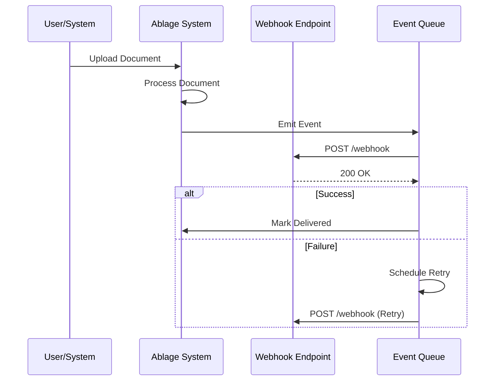

# Webhooks Guide

## Inhaltsverzeichnis

1. [Übersicht](#übersicht)
2. [Webhook-Konzepte](#webhook-konzepte)
3. [Event-Typen](#event-typen)
4. [Webhook-Registrierung](#webhook-registrierung)
5. [Payload-Struktur](#payload-struktur)
6. [Sicherheit](#sicherheit)
7. [Webhook-Empfänger Implementierung](#webhook-empfänger-implementierung)
8. [Retry-Logik](#retry-logik)
9. [Webhook-Testing](#webhook-testing)
10. [Monitoring](#monitoring)
11. [Best Practices](#best-practices)
12. [Troubleshooting](#troubleshooting)
13. [Appendix](#appendix)

---

## Übersicht

### Was sind Webhooks?

Webhooks sind HTTP-Callbacks, die es dem Ablage System ermöglichen, externe Systeme in Echtzeit über Events zu benachrichtigen. Anstatt kontinuierlich nach Updates zu fragen (Polling), sendet das System automatisch Benachrichtigungen an konfigurierte Endpunkte.

### Vorteile von Webhooks

**Real-time Updates**
- Sofortige Benachrichtigung bei Events
- Keine Verzögerung durch Polling-Intervalle
- Aktuelle Daten ohne Latenz

**Effizienz**
- Reduziert unnötige API-Aufrufe
- Spart Bandbreite und Server-Ressourcen
- Skaliert besser als Polling

**Integration**
- Einfache Integration mit externen Systemen
- Ereignisgesteuerte Workflows
- Automatisierung von Prozessen

### Webhook-Flow



---

## Webhook-Konzepte

### Event-Driven Architecture

**Event Producer**
```python
# backend/services/event_service.py
from typing import Dict, Any
import logging

from backend.models.webhook import WebhookEvent
from backend.tasks.webhook_tasks import send_webhook_task

logger = logging.getLogger(__name__)

class EventService:
    """Service for emitting events."""

    @staticmethod
    async def emit(
        event_type: str,
        payload: Dict[str, Any],
        user_id: str = None
    ) -> WebhookEvent:
        """
        Emit an event.

        Args:
            event_type: Type of event (e.g., 'document.created')
            payload: Event data
            user_id: User ID (optional, for filtering subscriptions)

        Returns:
            Created webhook event
        """
        logger.info(
            f"Emitting event: {event_type}",
            extra={"event_type": event_type, "user_id": user_id}
        )

        # Create event record
        event = WebhookEvent(
            event_type=event_type,
            payload=payload,
            user_id=user_id
        )
        db.add(event)
        db.commit()

        # Trigger webhook delivery (async)
        send_webhook_task.delay(event.id)

        return event
```

**Event Consumer**
```python
# External system webhook endpoint
from flask import Flask, request, jsonify
import hmac
import hashlib

app = Flask(__name__)

@app.route('/webhook', methods=['POST'])
def handle_webhook():
    """Handle incoming webhook from Ablage System."""

    # Verify signature
    signature = request.headers.get('X-Webhook-Signature')
    if not verify_signature(request.data, signature):
        return jsonify({"error": "Invalid signature"}), 401

    # Parse payload
    payload = request.json

    event_type = payload.get('event_type')
    data = payload.get('data')

    # Handle event
    if event_type == 'document.created':
        handle_document_created(data)
    elif event_type == 'document.completed':
        handle_document_completed(data)
    # ... handle other events

    return jsonify({"status": "success"}), 200

def verify_signature(payload: bytes, signature: str) -> bool:
    """Verify HMAC signature."""
    secret = os.getenv('WEBHOOK_SECRET')
    expected = hmac.new(
        secret.encode(),
        payload,
        hashlib.sha256
    ).hexdigest()
    return hmac.compare_digest(signature, expected)
```

### Subscription Model

**Webhook Subscription**
```python
# backend/models/webhook.py
from sqlalchemy import Column, String, Boolean, TIMESTAMP, JSON
from sqlalchemy.dialects.postgresql import UUID, ARRAY
import uuid

from backend.models.base import Base

class WebhookSubscription(Base):
    """Webhook subscription model."""

    __tablename__ = "webhook_subscriptions"

    id = Column(UUID(as_uuid=True), primary_key=True, default=uuid.uuid4)
    user_id = Column(UUID(as_uuid=True), nullable=False, index=True)

    # Endpoint configuration
    url = Column(String(500), nullable=False)
    description = Column(String(200))
    is_active = Column(Boolean, default=True, nullable=False)

    # Event filtering
    event_types = Column(ARRAY(String(100)), nullable=False)
    # e.g., ['document.created', 'document.completed']

    # Security
    secret = Column(String(100), nullable=False)  # HMAC secret

    # Retry configuration
    max_retries = Column(Integer, default=3)
    retry_delay = Column(Integer, default=60)  # seconds

    # Metadata
    headers = Column(JSON)  # Custom headers to send
    created_at = Column(TIMESTAMP, server_default=func.now())
    updated_at = Column(TIMESTAMP, server_default=func.now(), onupdate=func.now())
```

---

## Event-Typen

### Document Events

**document.created**
```json
{
  "event_id": "evt_abc123",
  "event_type": "document.created",
  "timestamp": "2025-01-17T10:30:00Z",
  "data": {
    "document_id": "doc_xyz789",
    "filename": "invoice_2025.pdf",
    "user_id": "user_123",
    "size": 1048576,
    "mime_type": "application/pdf",
    "created_at": "2025-01-17T10:30:00Z"
  }
}
```

**document.processing**
```json
{
  "event_id": "evt_def456",
  "event_type": "document.processing",
  "timestamp": "2025-01-17T10:30:05Z",
  "data": {
    "document_id": "doc_xyz789",
    "status": "processing",
    "ocr_backend": "deepseek-janus-pro",
    "progress": 25,
    "estimated_completion": "2025-01-17T10:32:00Z"
  }
}
```

**document.completed**
```json
{
  "event_id": "evt_ghi789",
  "event_type": "document.completed",
  "timestamp": "2025-01-17T10:32:00Z",
  "data": {
    "document_id": "doc_xyz789",
    "status": "completed",
    "ocr_backend": "deepseek-janus-pro",
    "confidence_score": 0.95,
    "processing_time": 120.5,
    "extracted_text": "Invoice #12345...",
    "metadata": {
      "pages": 3,
      "language": "de"
    }
  }
}
```

**document.failed**
```json
{
  "event_id": "evt_jkl012",
  "event_type": "document.failed",
  "timestamp": "2025-01-17T10:32:00Z",
  "data": {
    "document_id": "doc_xyz789",
    "status": "failed",
    "error_code": "OCR_TIMEOUT",
    "error_message": "OCR processing timed out after 300 seconds",
    "retry_count": 2,
    "can_retry": true
  }
}
```

**document.updated**
```json
{
  "event_id": "evt_mno345",
  "event_type": "document.updated",
  "timestamp": "2025-01-17T10:35:00Z",
  "data": {
    "document_id": "doc_xyz789",
    "changes": {
      "tags": {
        "old": ["invoice"],
        "new": ["invoice", "paid"]
      },
      "metadata": {
        "old": {},
        "new": {"invoice_number": "12345"}
      }
    },
    "updated_by": "user_123"
  }
}
```

**document.deleted**
```json
{
  "event_id": "evt_pqr678",
  "event_type": "document.deleted",
  "timestamp": "2025-01-17T10:40:00Z",
  "data": {
    "document_id": "doc_xyz789",
    "deleted_by": "user_123",
    "deleted_at": "2025-01-17T10:40:00Z"
  }
}
```

### User Events

**user.created**
```json
{
  "event_id": "evt_stu901",
  "event_type": "user.created",
  "timestamp": "2025-01-17T10:00:00Z",
  "data": {
    "user_id": "user_456",
    "email": "newuser@example.com",
    "role": "user",
    "created_at": "2025-01-17T10:00:00Z"
  }
}
```

**user.updated**
```json
{
  "event_id": "evt_vwx234",
  "event_type": "user.updated",
  "timestamp": "2025-01-17T10:15:00Z",
  "data": {
    "user_id": "user_456",
    "changes": {
      "role": {
        "old": "user",
        "new": "admin"
      }
    },
    "updated_by": "user_123"
  }
}
```

### System Events

**system.health_check_failed**
```json
{
  "event_id": "evt_yza567",
  "event_type": "system.health_check_failed",
  "timestamp": "2025-01-17T10:45:00Z",
  "data": {
    "service": "ocr-backend",
    "check_type": "liveness",
    "error": "Connection refused",
    "consecutive_failures": 3
  }
}
```

**system.quota_exceeded**
```json
{
  "event_id": "evt_bcd890",
  "event_type": "system.quota_exceeded",
  "timestamp": "2025-01-17T10:50:00Z",
  "data": {
    "user_id": "user_123",
    "quota_type": "documents_per_month",
    "limit": 1000,
    "current": 1001
  }
}
```

---

## Webhook-Registrierung

### API Endpoints

**Create Webhook Subscription**
```http
POST /api/v1/webhooks
Content-Type: application/json
Authorization: Bearer <token>

{
  "url": "https://example.com/webhook",
  "description": "Production webhook",
  "event_types": [
    "document.created",
    "document.completed",
    "document.failed"
  ],
  "headers": {
    "X-Custom-Header": "value"
  }
}
```

**Response**
```json
{
  "id": "webhook_abc123",
  "url": "https://example.com/webhook",
  "description": "Production webhook",
  "event_types": [
    "document.created",
    "document.completed",
    "document.failed"
  ],
  "secret": "whsec_3f2a1b4c5d6e7f8g9h0i",
  "is_active": true,
  "created_at": "2025-01-17T10:00:00Z"
}
```

**List Webhook Subscriptions**
```http
GET /api/v1/webhooks
Authorization: Bearer <token>
```

**Response**
```json
{
  "webhooks": [
    {
      "id": "webhook_abc123",
      "url": "https://example.com/webhook",
      "description": "Production webhook",
      "event_types": ["document.created", "document.completed"],
      "is_active": true,
      "created_at": "2025-01-17T10:00:00Z"
    }
  ],
  "total": 1
}
```

**Update Webhook Subscription**
```http
PATCH /api/v1/webhooks/{webhook_id}
Content-Type: application/json
Authorization: Bearer <token>

{
  "event_types": [
    "document.created",
    "document.completed",
    "document.failed",
    "document.updated"
  ]
}
```

**Delete Webhook Subscription**
```http
DELETE /api/v1/webhooks/{webhook_id}
Authorization: Bearer <token>
```

**Rotate Secret**
```http
POST /api/v1/webhooks/{webhook_id}/rotate-secret
Authorization: Bearer <token>
```

**Response**
```json
{
  "id": "webhook_abc123",
  "secret": "whsec_9i0h8g7f6e5d4c3b2a1",
  "rotated_at": "2025-01-17T11:00:00Z"
}
```

### Implementation

```python
# backend/api/v1/webhooks.py
from fastapi import APIRouter, Depends, HTTPException, status
from sqlalchemy.orm import Session
from typing import List
import secrets

from backend.schemas.webhook import (
    WebhookSubscriptionCreate,
    WebhookSubscriptionUpdate,
    WebhookSubscriptionResponse
)
from backend.models.webhook import WebhookSubscription
from backend.api.dependencies import get_db, get_current_user
from backend.models.user import User

router = APIRouter(prefix="/webhooks", tags=["webhooks"])

@router.post("/", response_model=WebhookSubscriptionResponse)
async def create_webhook(
    webhook_data: WebhookSubscriptionCreate,
    current_user: User = Depends(get_current_user),
    db: Session = Depends(get_db)
) -> WebhookSubscription:
    """
    Create a new webhook subscription.

    Args:
        webhook_data: Webhook configuration
        current_user: Currently authenticated user
        db: Database session

    Returns:
        Created webhook subscription

    Raises:
        HTTPException: If validation fails
    """
    # Validate URL
    if not webhook_data.url.startswith(('http://', 'https://')):
        raise HTTPException(
            status_code=status.HTTP_400_BAD_REQUEST,
            detail="Webhook URL must start with http:// or https://"
        )

    # Validate event types
    valid_event_types = get_valid_event_types()
    for event_type in webhook_data.event_types:
        if event_type not in valid_event_types:
            raise HTTPException(
                status_code=status.HTTP_400_BAD_REQUEST,
                detail=f"Invalid event type: {event_type}"
            )

    # Generate secret
    secret = generate_webhook_secret()

    # Create subscription
    webhook = WebhookSubscription(
        user_id=current_user.id,
        url=webhook_data.url,
        description=webhook_data.description,
        event_types=webhook_data.event_types,
        secret=secret,
        headers=webhook_data.headers or {}
    )

    db.add(webhook)
    db.commit()
    db.refresh(webhook)

    return webhook

@router.get("/", response_model=List[WebhookSubscriptionResponse])
async def list_webhooks(
    current_user: User = Depends(get_current_user),
    db: Session = Depends(get_db)
) -> List[WebhookSubscription]:
    """List all webhook subscriptions for current user."""
    webhooks = db.query(WebhookSubscription).filter(
        WebhookSubscription.user_id == current_user.id
    ).all()

    return webhooks

@router.get("/{webhook_id}", response_model=WebhookSubscriptionResponse)
async def get_webhook(
    webhook_id: str,
    current_user: User = Depends(get_current_user),
    db: Session = Depends(get_db)
) -> WebhookSubscription:
    """Get webhook subscription by ID."""
    webhook = db.query(WebhookSubscription).filter(
        WebhookSubscription.id == webhook_id,
        WebhookSubscription.user_id == current_user.id
    ).first()

    if not webhook:
        raise HTTPException(
            status_code=status.HTTP_404_NOT_FOUND,
            detail="Webhook not found"
        )

    return webhook

@router.patch("/{webhook_id}", response_model=WebhookSubscriptionResponse)
async def update_webhook(
    webhook_id: str,
    webhook_data: WebhookSubscriptionUpdate,
    current_user: User = Depends(get_current_user),
    db: Session = Depends(get_db)
) -> WebhookSubscription:
    """Update webhook subscription."""
    webhook = db.query(WebhookSubscription).filter(
        WebhookSubscription.id == webhook_id,
        WebhookSubscription.user_id == current_user.id
    ).first()

    if not webhook:
        raise HTTPException(
            status_code=status.HTTP_404_NOT_FOUND,
            detail="Webhook not found"
        )

    # Update fields
    if webhook_data.url is not None:
        webhook.url = webhook_data.url
    if webhook_data.description is not None:
        webhook.description = webhook_data.description
    if webhook_data.event_types is not None:
        webhook.event_types = webhook_data.event_types
    if webhook_data.is_active is not None:
        webhook.is_active = webhook_data.is_active
    if webhook_data.headers is not None:
        webhook.headers = webhook_data.headers

    db.commit()
    db.refresh(webhook)

    return webhook

@router.delete("/{webhook_id}", status_code=status.HTTP_204_NO_CONTENT)
async def delete_webhook(
    webhook_id: str,
    current_user: User = Depends(get_current_user),
    db: Session = Depends(get_db)
):
    """Delete webhook subscription."""
    webhook = db.query(WebhookSubscription).filter(
        WebhookSubscription.id == webhook_id,
        WebhookSubscription.user_id == current_user.id
    ).first()

    if not webhook:
        raise HTTPException(
            status_code=status.HTTP_404_NOT_FOUND,
            detail="Webhook not found"
        )

    db.delete(webhook)
    db.commit()

@router.post("/{webhook_id}/rotate-secret")
async def rotate_secret(
    webhook_id: str,
    current_user: User = Depends(get_current_user),
    db: Session = Depends(get_db)
):
    """Rotate webhook secret."""
    webhook = db.query(WebhookSubscription).filter(
        WebhookSubscription.id == webhook_id,
        WebhookSubscription.user_id == current_user.id
    ).first()

    if not webhook:
        raise HTTPException(
            status_code=status.HTTP_404_NOT_FOUND,
            detail="Webhook not found"
        )

    # Generate new secret
    webhook.secret = generate_webhook_secret()
    db.commit()

    return {
        "id": webhook.id,
        "secret": webhook.secret,
        "rotated_at": webhook.updated_at
    }

def generate_webhook_secret() -> str:
    """Generate a secure webhook secret."""
    return f"whsec_{secrets.token_urlsafe(32)}"

def get_valid_event_types() -> List[str]:
    """Get list of valid event types."""
    return [
        # Document events
        "document.created",
        "document.processing",
        "document.completed",
        "document.failed",
        "document.updated",
        "document.deleted",

        # User events
        "user.created",
        "user.updated",
        "user.deleted",

        # System events
        "system.health_check_failed",
        "system.quota_exceeded"
    ]
```

---

## Payload-Struktur

### Standard Webhook Payload

Alle Webhooks folgen einer konsistenten Struktur:

```typescript
// Webhook Payload Structure
interface WebhookPayload {
  // Event metadata
  event_id: string;          // Unique event ID
  event_type: string;        // Event type (e.g., 'document.created')
  timestamp: string;         // ISO 8601 timestamp
  api_version: string;       // API version (e.g., 'v1')

  // Event data
  data: {
    [key: string]: any;      // Event-specific data
  };

  // Metadata
  metadata?: {
    user_id?: string;
    request_id?: string;
    source?: string;
  };
}
```

### Vollständiges Beispiel

```json
{
  "event_id": "evt_1a2b3c4d5e6f7g8h",
  "event_type": "document.completed",
  "timestamp": "2025-01-17T10:32:00.123Z",
  "api_version": "v1",
  "data": {
    "document_id": "doc_xyz789",
    "filename": "invoice_2025.pdf",
    "status": "completed",
    "ocr_backend": "deepseek-janus-pro",
    "confidence_score": 0.95,
    "processing_time": 120.5,
    "extracted_text": "Invoice #12345\nDate: 2025-01-17\nTotal: €1,234.56",
    "metadata": {
      "pages": 3,
      "language": "de",
      "detected_entities": ["invoice_number", "date", "amount"]
    },
    "created_at": "2025-01-17T10:30:00Z",
    "completed_at": "2025-01-17T10:32:00Z"
  },
  "metadata": {
    "user_id": "user_123",
    "request_id": "req_abc456",
    "source": "api"
  }
}
```

---

## Sicherheit

### HMAC Signature Verification

**Backend: Signature Generation**
```python
# backend/services/webhook_service.py
import hmac
import hashlib
import json
from typing import Dict, Any

def generate_signature(payload: Dict[str, Any], secret: str) -> str:
    """
    Generate HMAC signature for webhook payload.

    Args:
        payload: Webhook payload
        secret: Webhook secret

    Returns:
        HMAC signature (hex)
    """
    payload_bytes = json.dumps(payload, separators=(',', ':')).encode('utf-8')

    signature = hmac.new(
        secret.encode('utf-8'),
        payload_bytes,
        hashlib.sha256
    ).hexdigest()

    return signature
```

**Client: Signature Verification**
```python
# Example webhook receiver
import hmac
import hashlib

def verify_webhook_signature(payload: bytes, signature: str, secret: str) -> bool:
    """
    Verify webhook HMAC signature.

    Args:
        payload: Raw request body (bytes)
        signature: Signature from X-Webhook-Signature header
        secret: Your webhook secret

    Returns:
        True if signature is valid
    """
    expected_signature = hmac.new(
        secret.encode('utf-8'),
        payload,
        hashlib.sha256
    ).hexdigest()

    return hmac.compare_digest(signature, expected_signature)

# Usage in Flask
from flask import Flask, request, jsonify

app = Flask(__name__)

@app.route('/webhook', methods=['POST'])
def handle_webhook():
    # Get signature from header
    signature = request.headers.get('X-Webhook-Signature')
    if not signature:
        return jsonify({"error": "Missing signature"}), 401

    # Verify signature
    secret = os.getenv('WEBHOOK_SECRET')
    if not verify_webhook_signature(request.data, signature, secret):
        return jsonify({"error": "Invalid signature"}), 401

    # Process webhook
    payload = request.json
    # ... handle event

    return jsonify({"status": "success"}), 200
```

**Client: Express.js Example**
```javascript
// Example webhook receiver in Express.js
const express = require('express');
const crypto = require('crypto');

const app = express();

// IMPORTANT: Use raw body for signature verification
app.use(express.json({
  verify: (req, res, buf) => {
    req.rawBody = buf;
  }
}));

app.post('/webhook', (req, res) => {
  const signature = req.headers['x-webhook-signature'];

  if (!signature) {
    return res.status(401).json({ error: 'Missing signature' });
  }

  // Verify signature
  const secret = process.env.WEBHOOK_SECRET;
  const expectedSignature = crypto
    .createHmac('sha256', secret)
    .update(req.rawBody)
    .digest('hex');

  if (!crypto.timingSafeEqual(
    Buffer.from(signature),
    Buffer.from(expectedSignature)
  )) {
    return res.status(401).json({ error: 'Invalid signature' });
  }

  // Process webhook
  const payload = req.body;
  console.log('Received event:', payload.event_type);

  // Handle event
  handleEvent(payload);

  res.json({ status: 'success' });
});

function handleEvent(payload) {
  switch (payload.event_type) {
    case 'document.created':
      console.log('Document created:', payload.data.document_id);
      break;
    case 'document.completed':
      console.log('Document completed:', payload.data.document_id);
      break;
    // ... handle other events
  }
}

app.listen(3000, () => {
  console.log('Webhook receiver listening on port 3000');
});
```

### IP Whitelisting

```python
# backend/services/webhook_service.py
from ipaddress import ip_address, ip_network
from typing import List

ALLOWED_IP_RANGES = [
    "192.168.1.0/24",
    "10.0.0.0/8",
    "172.16.0.0/12"
]

def is_ip_allowed(ip: str) -> bool:
    """
    Check if IP address is in allowed ranges.

    Args:
        ip: IP address to check

    Returns:
        True if IP is allowed
    """
    try:
        ip_addr = ip_address(ip)

        for allowed_range in ALLOWED_IP_RANGES:
            if ip_addr in ip_network(allowed_range):
                return True

        return False

    except ValueError:
        return False

# Usage in webhook delivery
async def send_webhook(webhook: WebhookSubscription, payload: Dict[str, Any]):
    """Send webhook with IP validation."""

    # Check if webhook URL resolves to allowed IP
    import socket
    hostname = urlparse(webhook.url).hostname
    ip = socket.gethostbyname(hostname)

    if not is_ip_allowed(ip):
        logger.warning(f"Webhook URL resolves to disallowed IP: {ip}")
        raise ValueError(f"Webhook IP not allowed: {ip}")

    # ... send webhook
```

### Rate Limiting

```python
# backend/services/webhook_service.py
from redis import Redis
from datetime import datetime, timedelta

redis_client = Redis.from_url(settings.REDIS_URL)

def check_rate_limit(webhook_id: str) -> bool:
    """
    Check if webhook is within rate limit.

    Args:
        webhook_id: Webhook subscription ID

    Returns:
        True if within rate limit
    """
    key = f"webhook:ratelimit:{webhook_id}"

    # Get current count
    current = redis_client.get(key)

    if current is None:
        # First request in window
        redis_client.setex(key, 60, 1)  # 1 request in 60 seconds
        return True

    current_count = int(current)

    # Check against limit (e.g., 60 requests per minute)
    if current_count >= 60:
        return False

    # Increment counter
    redis_client.incr(key)
    return True
```

---

## Webhook-Empfänger Implementierung

### Python (FastAPI)

```python
# webhook_receiver.py
from fastapi import FastAPI, Request, HTTPException, Header
from typing import Optional
import hmac
import hashlib
import os

app = FastAPI()

WEBHOOK_SECRET = os.getenv("WEBHOOK_SECRET")

@app.post("/webhook")
async def handle_webhook(
    request: Request,
    x_webhook_signature: Optional[str] = Header(None)
):
    """Handle incoming webhook from Ablage System."""

    # Get raw body
    body = await request.body()

    # Verify signature
    if not x_webhook_signature:
        raise HTTPException(status_code=401, detail="Missing signature")

    expected_signature = hmac.new(
        WEBHOOK_SECRET.encode(),
        body,
        hashlib.sha256
    ).hexdigest()

    if not hmac.compare_digest(x_webhook_signature, expected_signature):
        raise HTTPException(status_code=401, detail="Invalid signature")

    # Parse payload
    payload = await request.json()

    event_type = payload.get("event_type")
    event_data = payload.get("data")

    # Handle event
    if event_type == "document.created":
        await handle_document_created(event_data)
    elif event_type == "document.completed":
        await handle_document_completed(event_data)
    elif event_type == "document.failed":
        await handle_document_failed(event_data)
    else:
        print(f"Unknown event type: {event_type}")

    return {"status": "success"}

async def handle_document_created(data: dict):
    """Handle document.created event."""
    document_id = data.get("document_id")
    filename = data.get("filename")

    print(f"Document created: {document_id} - {filename}")

    # Your business logic here
    # e.g., Send notification, update database, trigger workflow

async def handle_document_completed(data: dict):
    """Handle document.completed event."""
    document_id = data.get("document_id")
    extracted_text = data.get("extracted_text")

    print(f"Document completed: {document_id}")
    print(f"Extracted text: {extracted_text[:100]}...")

    # Your business logic here
    # e.g., Process extracted text, update records

async def handle_document_failed(data: dict):
    """Handle document.failed event."""
    document_id = data.get("document_id")
    error_message = data.get("error_message")

    print(f"Document failed: {document_id}")
    print(f"Error: {error_message}")

    # Your business logic here
    # e.g., Send alert, retry processing

if __name__ == "__main__":
    import uvicorn
    uvicorn.run(app, host="0.0.0.0", port=8080)
```

### Node.js (Express)

```javascript
// webhook-receiver.js
const express = require('express');
const crypto = require('crypto');

const app = express();
const PORT = process.env.PORT || 3000;
const WEBHOOK_SECRET = process.env.WEBHOOK_SECRET;

// Middleware to capture raw body
app.use(express.json({
  verify: (req, res, buf) => {
    req.rawBody = buf;
  }
}));

app.post('/webhook', (req, res) => {
  // Verify signature
  const signature = req.headers['x-webhook-signature'];

  if (!signature) {
    return res.status(401).json({ error: 'Missing signature' });
  }

  const expectedSignature = crypto
    .createHmac('sha256', WEBHOOK_SECRET)
    .update(req.rawBody)
    .digest('hex');

  if (!crypto.timingSafeEqual(
    Buffer.from(signature),
    Buffer.from(expectedSignature)
  )) {
    return res.status(401).json({ error: 'Invalid signature' });
  }

  // Parse payload
  const payload = req.body;
  const { event_type, data } = payload;

  console.log(`Received event: ${event_type}`);

  // Handle event
  switch (event_type) {
    case 'document.created':
      handleDocumentCreated(data);
      break;
    case 'document.completed':
      handleDocumentCompleted(data);
      break;
    case 'document.failed':
      handleDocumentFailed(data);
      break;
    default:
      console.log(`Unknown event type: ${event_type}`);
  }

  res.json({ status: 'success' });
});

function handleDocumentCreated(data) {
  console.log('Document created:', data.document_id);
  // Your business logic
}

function handleDocumentCompleted(data) {
  console.log('Document completed:', data.document_id);
  console.log('Extracted text:', data.extracted_text.substring(0, 100));
  // Your business logic
}

function handleDocumentFailed(data) {
  console.log('Document failed:', data.document_id);
  console.log('Error:', data.error_message);
  // Your business logic
}

app.listen(PORT, () => {
  console.log(`Webhook receiver listening on port ${PORT}`);
});
```

### Go

```go
// webhook_receiver.go
package main

import (
    "crypto/hmac"
    "crypto/sha256"
    "encoding/hex"
    "encoding/json"
    "fmt"
    "io"
    "log"
    "net/http"
    "os"
)

type WebhookPayload struct {
    EventID   string                 `json:"event_id"`
    EventType string                 `json:"event_type"`
    Timestamp string                 `json:"timestamp"`
    Data      map[string]interface{} `json:"data"`
}

var webhookSecret = os.Getenv("WEBHOOK_SECRET")

func main() {
    http.HandleFunc("/webhook", handleWebhook)

    port := os.Getenv("PORT")
    if port == "" {
        port = "8080"
    }

    log.Printf("Webhook receiver listening on port %s", port)
    log.Fatal(http.ListenAndServe(":"+port, nil))
}

func handleWebhook(w http.ResponseWriter, r *http.Request) {
    if r.Method != http.MethodPost {
        http.Error(w, "Method not allowed", http.StatusMethodNotAllowed)
        return
    }

    // Read body
    body, err := io.ReadAll(r.Body)
    if err != nil {
        http.Error(w, "Error reading body", http.StatusBadRequest)
        return
    }
    defer r.Body.Close()

    // Verify signature
    signature := r.Header.Get("X-Webhook-Signature")
    if signature == "" {
        http.Error(w, "Missing signature", http.StatusUnauthorized)
        return
    }

    if !verifySignature(body, signature) {
        http.Error(w, "Invalid signature", http.StatusUnauthorized)
        return
    }

    // Parse payload
    var payload WebhookPayload
    if err := json.Unmarshal(body, &payload); err != nil {
        http.Error(w, "Error parsing JSON", http.StatusBadRequest)
        return
    }

    // Handle event
    switch payload.EventType {
    case "document.created":
        handleDocumentCreated(payload.Data)
    case "document.completed":
        handleDocumentCompleted(payload.Data)
    case "document.failed":
        handleDocumentFailed(payload.Data)
    default:
        log.Printf("Unknown event type: %s", payload.EventType)
    }

    w.Header().Set("Content-Type", "application/json")
    w.WriteHeader(http.StatusOK)
    json.NewEncoder(w).Encode(map[string]string{"status": "success"})
}

func verifySignature(payload []byte, signature string) bool {
    mac := hmac.New(sha256.New, []byte(webhookSecret))
    mac.Write(payload)
    expectedSignature := hex.EncodeToString(mac.Sum(nil))

    return hmac.Equal([]byte(signature), []byte(expectedSignature))
}

func handleDocumentCreated(data map[string]interface{}) {
    documentID := data["document_id"].(string)
    filename := data["filename"].(string)

    log.Printf("Document created: %s - %s", documentID, filename)
    // Your business logic
}

func handleDocumentCompleted(data map[string]interface{}) {
    documentID := data["document_id"].(string)
    extractedText := data["extracted_text"].(string)

    log.Printf("Document completed: %s", documentID)
    log.Printf("Extracted text: %s...", extractedText[:100])
    // Your business logic
}

func handleDocumentFailed(data map[string]interface{}) {
    documentID := data["document_id"].(string)
    errorMessage := data["error_message"].(string)

    log.Printf("Document failed: %s", documentID)
    log.Printf("Error: %s", errorMessage)
    // Your business logic
}
```

### PHP

```php
<?php
// webhook_receiver.php

$webhookSecret = getenv('WEBHOOK_SECRET');

// Get raw POST body
$rawBody = file_get_contents('php://input');

// Verify signature
$signature = $_SERVER['HTTP_X_WEBHOOK_SIGNATURE'] ?? '';

if (empty($signature)) {
    http_response_code(401);
    echo json_encode(['error' => 'Missing signature']);
    exit;
}

$expectedSignature = hash_hmac('sha256', $rawBody, $webhookSecret);

if (!hash_equals($signature, $expectedSignature)) {
    http_response_code(401);
    echo json_encode(['error' => 'Invalid signature']);
    exit;
}

// Parse payload
$payload = json_decode($rawBody, true);

if (json_last_error() !== JSON_ERROR_NONE) {
    http_response_code(400);
    echo json_encode(['error' => 'Invalid JSON']);
    exit;
}

$eventType = $payload['event_type'] ?? '';
$data = $payload['data'] ?? [];

// Handle event
switch ($eventType) {
    case 'document.created':
        handleDocumentCreated($data);
        break;
    case 'document.completed':
        handleDocumentCompleted($data);
        break;
    case 'document.failed':
        handleDocumentFailed($data);
        break;
    default:
        error_log("Unknown event type: $eventType");
}

http_response_code(200);
echo json_encode(['status' => 'success']);

function handleDocumentCreated($data) {
    $documentId = $data['document_id'] ?? '';
    $filename = $data['filename'] ?? '';

    error_log("Document created: $documentId - $filename");
    // Your business logic
}

function handleDocumentCompleted($data) {
    $documentId = $data['document_id'] ?? '';
    $extractedText = $data['extracted_text'] ?? '';

    error_log("Document completed: $documentId");
    error_log("Extracted text: " . substr($extractedText, 0, 100) . "...");
    // Your business logic
}

function handleDocumentFailed($data) {
    $documentId = $data['document_id'] ?? '';
    $errorMessage = $data['error_message'] ?? '';

    error_log("Document failed: $documentId");
    error_log("Error: $errorMessage");
    // Your business logic
}
?>
```

---

## Retry-Logik

### Exponential Backoff

```python
# backend/services/webhook_service.py
from typing import Dict, Any
import asyncio
import logging
from datetime import datetime, timedelta

import httpx

logger = logging.getLogger(__name__)

class WebhookDeliveryService:
    """Service for delivering webhooks with retry logic."""

    def __init__(self):
        self.client = httpx.AsyncClient(timeout=30.0)

    async def deliver(
        self,
        webhook: WebhookSubscription,
        payload: Dict[str, Any],
        attempt: int = 1
    ) -> bool:
        """
        Deliver webhook with exponential backoff retry.

        Args:
            webhook: Webhook subscription
            payload: Payload to send
            attempt: Current attempt number

        Returns:
            True if delivered successfully
        """
        max_attempts = webhook.max_retries + 1

        if attempt > max_attempts:
            logger.error(
                f"Webhook delivery failed after {max_attempts} attempts",
                extra={"webhook_id": webhook.id, "url": webhook.url}
            )
            return False

        try:
            # Calculate backoff delay (exponential: 1s, 2s, 4s, 8s, ...)
            if attempt > 1:
                delay = min(2 ** (attempt - 2), 300)  # Max 5 minutes
                logger.info(f"Retrying webhook delivery in {delay}s (attempt {attempt}/{max_attempts})")
                await asyncio.sleep(delay)

            # Generate signature
            signature = generate_signature(payload, webhook.secret)

            # Prepare headers
            headers = {
                "Content-Type": "application/json",
                "X-Webhook-Signature": signature,
                "X-Webhook-Delivery-ID": str(uuid.uuid4()),
                "X-Webhook-Attempt": str(attempt),
                "User-Agent": "Ablage-Webhook/1.0"
            }

            # Add custom headers
            if webhook.headers:
                headers.update(webhook.headers)

            # Send webhook
            response = await self.client.post(
                webhook.url,
                json=payload,
                headers=headers
            )

            # Check response
            if response.status_code in [200, 201, 202, 204]:
                logger.info(
                    f"Webhook delivered successfully",
                    extra={
                        "webhook_id": webhook.id,
                        "url": webhook.url,
                        "attempt": attempt,
                        "status_code": response.status_code
                    }
                )
                return True

            # Non-success status code
            logger.warning(
                f"Webhook delivery failed with status {response.status_code}",
                extra={
                    "webhook_id": webhook.id,
                    "url": webhook.url,
                    "attempt": attempt,
                    "response": response.text[:500]
                }
            )

            # Retry on certain status codes
            if response.status_code in [408, 429, 500, 502, 503, 504]:
                return await self.deliver(webhook, payload, attempt + 1)

            return False

        except httpx.TimeoutException:
            logger.warning(
                f"Webhook delivery timed out",
                extra={"webhook_id": webhook.id, "url": webhook.url, "attempt": attempt}
            )
            return await self.deliver(webhook, payload, attempt + 1)

        except Exception as e:
            logger.error(
                f"Webhook delivery error: {e}",
                extra={"webhook_id": webhook.id, "url": webhook.url, "attempt": attempt},
                exc_info=True
            )
            return await self.deliver(webhook, payload, attempt + 1)
```

### Celery Task

```python
# backend/tasks/webhook_tasks.py
from celery import shared_task
from sqlalchemy.orm import Session

from backend.models.webhook import WebhookSubscription, WebhookDelivery
from backend.services.webhook_service import WebhookDeliveryService
from backend.core.database import SessionLocal

@shared_task(
    bind=True,
    max_retries=3,
    default_retry_delay=60
)
def send_webhook_task(self, event_id: str):
    """
    Send webhook for an event.

    Args:
        event_id: Event ID to send webhook for
    """
    db = SessionLocal()
    try:
        # Get event
        event = db.query(WebhookEvent).filter(
            WebhookEvent.id == event_id
        ).first()

        if not event:
            logger.error(f"Event not found: {event_id}")
            return

        # Get active subscriptions for this event type
        subscriptions = db.query(WebhookSubscription).filter(
            WebhookSubscription.is_active == True,
            WebhookSubscription.event_types.contains([event.event_type])
        )

        # Filter by user_id if event has one
        if event.user_id:
            subscriptions = subscriptions.filter(
                WebhookSubscription.user_id == event.user_id
            )

        subscriptions = subscriptions.all()

        # Prepare payload
        payload = {
            "event_id": str(event.id),
            "event_type": event.event_type,
            "timestamp": event.created_at.isoformat(),
            "api_version": "v1",
            "data": event.payload
        }

        # Send to each subscription
        delivery_service = WebhookDeliveryService()

        for subscription in subscriptions:
            # Create delivery record
            delivery = WebhookDelivery(
                event_id=event.id,
                subscription_id=subscription.id,
                status="pending"
            )
            db.add(delivery)
            db.commit()

            # Deliver webhook
            try:
                success = await delivery_service.deliver(subscription, payload)

                if success:
                    delivery.status = "delivered"
                    delivery.delivered_at = datetime.utcnow()
                else:
                    delivery.status = "failed"
                    delivery.failed_at = datetime.utcnow()

                db.commit()

            except Exception as e:
                logger.error(f"Webhook delivery exception: {e}", exc_info=True)
                delivery.status = "failed"
                delivery.error_message = str(e)
                delivery.failed_at = datetime.utcnow()
                db.commit()

    finally:
        db.close()
```

---

## Webhook-Testing

### Test Endpoints

**Webhook.site**
```bash
# Use webhook.site for testing
curl -X POST https://webhook.site/{your-unique-url} \
  -H "Content-Type: application/json" \
  -H "X-Webhook-Signature: test" \
  -d '{
    "event_type": "document.created",
    "data": {
      "document_id": "test_123",
      "filename": "test.pdf"
    }
  }'
```

**RequestBin**
```bash
# Use requestbin.com for testing
curl -X POST https://requestbin.com/{your-bin-id} \
  -H "Content-Type: application/json" \
  -d '{"test": "data"}'
```

### Local Testing with ngrok

```bash
# Install ngrok
brew install ngrok  # macOS
# or download from https://ngrok.com

# Start your local webhook receiver
python webhook_receiver.py  # Running on port 8080

# Create tunnel
ngrok http 8080

# Use the ngrok URL in webhook configuration
# e.g., https://abc123.ngrok.io/webhook
```

### Testing Script

```python
# tests/test_webhook_delivery.py
import pytest
from unittest.mock import Mock, patch
import httpx

from backend.services.webhook_service import WebhookDeliveryService
from backend.models.webhook import WebhookSubscription

@pytest.fixture
def webhook_subscription():
    """Create test webhook subscription."""
    return WebhookSubscription(
        id="test_webhook",
        url="https://example.com/webhook",
        secret="test_secret",
        event_types=["document.created"],
        max_retries=3
    )

@pytest.fixture
def test_payload():
    """Create test payload."""
    return {
        "event_id": "evt_test",
        "event_type": "document.created",
        "timestamp": "2025-01-17T10:00:00Z",
        "data": {
            "document_id": "doc_test",
            "filename": "test.pdf"
        }
    }

@pytest.mark.asyncio
async def test_successful_delivery(webhook_subscription, test_payload):
    """Test successful webhook delivery."""
    service = WebhookDeliveryService()

    with patch.object(service.client, 'post') as mock_post:
        mock_response = Mock()
        mock_response.status_code = 200
        mock_post.return_value = mock_response

        result = await service.deliver(webhook_subscription, test_payload)

        assert result is True
        mock_post.assert_called_once()

@pytest.mark.asyncio
async def test_retry_on_timeout(webhook_subscription, test_payload):
    """Test retry on timeout."""
    service = WebhookDeliveryService()

    with patch.object(service.client, 'post') as mock_post:
        # First call times out, second succeeds
        mock_post.side_effect = [
            httpx.TimeoutException("Timeout"),
            Mock(status_code=200)
        ]

        result = await service.deliver(webhook_subscription, test_payload)

        assert result is True
        assert mock_post.call_count == 2

@pytest.mark.asyncio
async def test_max_retries_exceeded(webhook_subscription, test_payload):
    """Test that delivery fails after max retries."""
    service = WebhookDeliveryService()

    with patch.object(service.client, 'post') as mock_post:
        mock_post.side_effect = httpx.TimeoutException("Timeout")

        result = await service.deliver(webhook_subscription, test_payload)

        assert result is False
        assert mock_post.call_count == 4  # 1 initial + 3 retries

@pytest.mark.asyncio
async def test_signature_generation(webhook_subscription, test_payload):
    """Test that signature is correctly generated."""
    service = WebhookDeliveryService()

    with patch.object(service.client, 'post') as mock_post:
        mock_post.return_value = Mock(status_code=200)

        await service.deliver(webhook_subscription, test_payload)

        call_args = mock_post.call_args
        headers = call_args.kwargs['headers']

        assert 'X-Webhook-Signature' in headers
        assert headers['X-Webhook-Signature'] != ''
```

---

## Monitoring

### Metrics

```python
# backend/services/webhook_service.py
from prometheus_client import Counter, Histogram, Gauge

webhook_deliveries_total = Counter(
    'webhook_deliveries_total',
    'Total webhook deliveries',
    ['status', 'event_type']
)

webhook_delivery_duration = Histogram(
    'webhook_delivery_duration_seconds',
    'Webhook delivery duration',
    ['event_type']
)

webhook_retry_count = Counter(
    'webhook_retry_total',
    'Total webhook retries',
    ['event_type']
)

active_webhooks = Gauge(
    'active_webhooks',
    'Number of active webhook subscriptions'
)

# Usage
async def deliver(self, webhook, payload, attempt=1):
    start_time = time.time()

    try:
        # ... delivery logic

        webhook_deliveries_total.labels(
            status='success',
            event_type=payload['event_type']
        ).inc()

        return True

    except Exception as e:
        webhook_deliveries_total.labels(
            status='failed',
            event_type=payload['event_type']
        ).inc()

        if attempt < max_attempts:
            webhook_retry_count.labels(
                event_type=payload['event_type']
            ).inc()

        raise

    finally:
        duration = time.time() - start_time
        webhook_delivery_duration.labels(
            event_type=payload['event_type']
        ).observe(duration)
```

### Webhook Delivery Dashboard

```yaml
# grafana/dashboards/webhook-delivery.json
{
  "dashboard": {
    "title": "Webhook Delivery",
    "panels": [
      {
        "title": "Delivery Success Rate",
        "targets": [
          {
            "expr": "rate(webhook_deliveries_total{status=\"success\"}[5m]) / rate(webhook_deliveries_total[5m])"
          }
        ]
      },
      {
        "title": "Delivery Duration",
        "targets": [
          {
            "expr": "histogram_quantile(0.95, rate(webhook_delivery_duration_seconds_bucket[5m]))"
          }
        ]
      },
      {
        "title": "Retry Rate",
        "targets": [
          {
            "expr": "rate(webhook_retry_total[5m])"
          }
        ]
      },
      {
        "title": "Active Subscriptions",
        "targets": [
          {
            "expr": "active_webhooks"
          }
        ]
      }
    ]
  }
}
```

### Logging

```python
# backend/core/logging.py
import logging
import json
from datetime import datetime

class WebhookLogger:
    """Structured logger for webhooks."""

    def __init__(self):
        self.logger = logging.getLogger("webhook")

    def log_delivery(
        self,
        webhook_id: str,
        event_type: str,
        status: str,
        duration: float,
        attempt: int = 1,
        error: str = None
    ):
        """Log webhook delivery."""
        log_data = {
            "timestamp": datetime.utcnow().isoformat(),
            "webhook_id": webhook_id,
            "event_type": event_type,
            "status": status,
            "duration": duration,
            "attempt": attempt
        }

        if error:
            log_data["error"] = error

        if status == "success":
            self.logger.info(json.dumps(log_data))
        else:
            self.logger.error(json.dumps(log_data))

# Usage
webhook_logger = WebhookLogger()

webhook_logger.log_delivery(
    webhook_id="webhook_123",
    event_type="document.created",
    status="success",
    duration=0.523,
    attempt=1
)
```

---

## Best Practices

### 1. Idempotency

Webhook-Empfänger sollten idempotent sein - mehrfaches Empfangen desselben Events sollte dasselbe Ergebnis haben.

```python
# Good: Idempotent webhook handler
@app.post("/webhook")
async def handle_webhook(request: Request):
    payload = await request.json()
    event_id = payload.get("event_id")

    # Check if event already processed
    if is_event_processed(event_id):
        logger.info(f"Event {event_id} already processed, skipping")
        return {"status": "success"}

    # Process event
    process_event(payload)

    # Mark event as processed
    mark_event_processed(event_id)

    return {"status": "success"}

def is_event_processed(event_id: str) -> bool:
    """Check if event was already processed."""
    return redis_client.exists(f"processed_event:{event_id}")

def mark_event_processed(event_id: str):
    """Mark event as processed (with TTL)."""
    redis_client.setex(
        f"processed_event:{event_id}",
        86400,  # 24 hours
        1
    )
```

### 2. Quick Response

Webhook-Empfänger sollten schnell antworten (< 5 Sekunden).

```python
# Good: Quick response, async processing
from celery import shared_task

@app.post("/webhook")
async def handle_webhook(request: Request):
    payload = await request.json()

    # Enqueue for async processing
    process_webhook_task.delay(payload)

    # Return immediately
    return {"status": "accepted"}

@shared_task
def process_webhook_task(payload):
    """Process webhook asynchronously."""
    # Long-running processing here
    ...
```

### 3. Error Handling

```python
# Good: Proper error handling
@app.post("/webhook")
async def handle_webhook(request: Request):
    try:
        payload = await request.json()

        # Validate payload
        validate_payload(payload)

        # Process event
        process_event(payload)

        return {"status": "success"}

    except ValueError as e:
        logger.error(f"Invalid payload: {e}")
        return {"error": "Invalid payload"}, 400

    except Exception as e:
        logger.error(f"Processing error: {e}", exc_info=True)
        # Return 500 to trigger retry
        return {"error": "Processing failed"}, 500
```

### 4. Monitoring

```python
# Good: Monitor webhook health
from prometheus_client import Counter, Histogram

webhook_received = Counter('webhook_received_total', 'Total webhooks received')
webhook_processed = Counter('webhook_processed_total', 'Total webhooks processed')
webhook_errors = Counter('webhook_errors_total', 'Total webhook errors')
webhook_duration = Histogram('webhook_duration_seconds', 'Webhook processing duration')

@app.post("/webhook")
async def handle_webhook(request: Request):
    webhook_received.inc()
    start_time = time.time()

    try:
        payload = await request.json()
        process_event(payload)

        webhook_processed.inc()
        return {"status": "success"}

    except Exception as e:
        webhook_errors.inc()
        logger.error(f"Error: {e}", exc_info=True)
        raise

    finally:
        webhook_duration.observe(time.time() - start_time)
```

### 5. Security

```python
# Good: Multiple security layers
@app.post("/webhook")
async def handle_webhook(
    request: Request,
    x_webhook_signature: str = Header(None)
):
    # 1. Verify signature
    if not verify_signature(await request.body(), x_webhook_signature):
        raise HTTPException(status_code=401, detail="Invalid signature")

    # 2. Check rate limit
    if not check_rate_limit(request.client.host):
        raise HTTPException(status_code=429, detail="Rate limit exceeded")

    # 3. Validate IP (if applicable)
    if not is_ip_allowed(request.client.host):
        raise HTTPException(status_code=403, detail="IP not allowed")

    # 4. Validate payload
    payload = await request.json()
    validate_payload(payload)

    # Process
    process_event(payload)

    return {"status": "success"}
```

---

## Troubleshooting

### Common Issues

**Issue 1: Signature Verification Fails**

```python
# Debug signature verification
import hmac
import hashlib
import json

def debug_signature(payload_bytes: bytes, signature: str, secret: str):
    """Debug signature verification."""

    # Calculate expected signature
    expected = hmac.new(
        secret.encode(),
        payload_bytes,
        hashlib.sha256
    ).hexdigest()

    print(f"Received signature: {signature}")
    print(f"Expected signature: {expected}")
    print(f"Match: {hmac.compare_digest(signature, expected)}")

    # Check common issues
    print(f"\nPayload length: {len(payload_bytes)}")
    print(f"Payload (first 100 chars): {payload_bytes[:100]}")

    # Try parsing as JSON
    try:
        parsed = json.loads(payload_bytes)
        print(f"Payload is valid JSON: Yes")
    except:
        print(f"Payload is valid JSON: No")
```

**Common causes:**
- Using parsed JSON instead of raw body
- Character encoding issues (use UTF-8)
- Trailing whitespace in secret
- Wrong hash algorithm (should be SHA-256)

**Issue 2: Webhook Not Received**

**Checklist:**
1. Check if webhook subscription is active
2. Verify URL is correct and accessible
3. Check firewall rules
4. Verify SSL certificate is valid
5. Check webhook delivery logs

```bash
# Check webhook delivery logs
docker-compose logs backend | grep "webhook"

# Check webhook subscription status
curl -X GET http://localhost:8000/api/v1/webhooks \
  -H "Authorization: Bearer $TOKEN"

# Test webhook URL manually
curl -X POST https://your-webhook-url.com/webhook \
  -H "Content-Type: application/json" \
  -d '{"test": "data"}'
```

**Issue 3: Duplicate Webhooks**

**Cause:** Retries or multiple event emissions

**Solution:** Implement idempotency

```python
# Track processed events
processed_events = set()

@app.post("/webhook")
async def handle_webhook(request: Request):
    payload = await request.json()
    event_id = payload.get("event_id")

    # Check if already processed
    if event_id in processed_events:
        logger.info(f"Duplicate event: {event_id}")
        return {"status": "success"}

    # Process
    process_event(payload)

    # Mark as processed
    processed_events.add(event_id)

    return {"status": "success"}
```

**Issue 4: Slow Webhook Processing**

**Solution:** Async processing

```python
# Bad: Synchronous processing
@app.post("/webhook")
async def handle_webhook(request: Request):
    payload = await request.json()
    # This takes 30 seconds!
    long_running_process(payload)
    return {"status": "success"}

# Good: Async processing
@app.post("/webhook")
async def handle_webhook(request: Request):
    payload = await request.json()
    # Queue for background processing
    queue.enqueue(long_running_process, payload)
    # Return immediately
    return {"status": "accepted"}
```

---

## Appendix

### A. Complete Event Type Reference

```typescript
// Document Events
type DocumentEvent =
  | 'document.created'
  | 'document.processing'
  | 'document.completed'
  | 'document.failed'
  | 'document.updated'
  | 'document.deleted';

// User Events
type UserEvent =
  | 'user.created'
  | 'user.updated'
  | 'user.deleted';

// System Events
type SystemEvent =
  | 'system.health_check_failed'
  | 'system.quota_exceeded'
  | 'system.backup_completed'
  | 'system.maintenance_scheduled';

type EventType = DocumentEvent | UserEvent | SystemEvent;
```

### B. Webhook Headers Reference

```markdown
# Webhook Request Headers

| Header | Description | Example |
|--------|-------------|---------|
| Content-Type | Always application/json | application/json |
| X-Webhook-Signature | HMAC SHA-256 signature | abc123def456... |
| X-Webhook-Delivery-ID | Unique delivery ID | delivery_xyz789 |
| X-Webhook-Attempt | Attempt number | 1, 2, 3 |
| User-Agent | Webhook user agent | Ablage-Webhook/1.0 |
```

### C. HTTP Status Code Handling

```markdown
# Status Codes and Retry Behavior

| Status Code | Meaning | Retry? |
|-------------|---------|--------|
| 200-204 | Success | No |
| 400 | Bad Request | No |
| 401 | Unauthorized | No |
| 403 | Forbidden | No |
| 404 | Not Found | No |
| 408 | Request Timeout | Yes |
| 429 | Rate Limited | Yes |
| 500 | Server Error | Yes |
| 502 | Bad Gateway | Yes |
| 503 | Service Unavailable | Yes |
| 504 | Gateway Timeout | Yes |
```

### D. Webhook Testing Checklist

```markdown
# Webhook Testing Checklist

## Setup
- [ ] Webhook subscription created
- [ ] Secret saved securely
- [ ] URL is publicly accessible
- [ ] SSL certificate is valid (for HTTPS)

## Signature Verification
- [ ] Signature header is read correctly
- [ ] Raw request body is used (not parsed)
- [ ] HMAC SHA-256 is used
- [ ] Timing-safe comparison is used

## Event Handling
- [ ] All expected event types are handled
- [ ] Unknown event types are logged
- [ ] Event data is validated
- [ ] Processing is idempotent

## Performance
- [ ] Response time < 5 seconds
- [ ] Long operations are queued
- [ ] Timeouts are configured

## Error Handling
- [ ] Errors are logged
- [ ] Appropriate status codes returned
- [ ] Retries are handled gracefully

## Monitoring
- [ ] Success/failure metrics tracked
- [ ] Alerts configured for failures
- [ ] Logs are structured and searchable
```

### E. Sample Webhook Receiver (Complete)

```python
# complete_webhook_receiver.py
"""
Complete webhook receiver with all best practices.
"""
from fastapi import FastAPI, Request, HTTPException, Header
from typing import Optional
import hmac
import hashlib
import logging
import time
from redis import Redis
from prometheus_client import Counter, Histogram
import os

# Configuration
WEBHOOK_SECRET = os.getenv("WEBHOOK_SECRET")
REDIS_URL = os.getenv("REDIS_URL", "redis://localhost:6379")

# Setup
app = FastAPI()
redis_client = Redis.from_url(REDIS_URL)
logger = logging.getLogger(__name__)

# Metrics
webhook_received = Counter('webhook_received_total', 'Total webhooks received')
webhook_processed = Counter('webhook_processed_total', 'Total webhooks processed', ['event_type'])
webhook_errors = Counter('webhook_errors_total', 'Total webhook errors', ['error_type'])
webhook_duration = Histogram('webhook_duration_seconds', 'Webhook processing duration')

@app.post("/webhook")
async def handle_webhook(
    request: Request,
    x_webhook_signature: Optional[str] = Header(None)
):
    """Handle incoming webhook with all best practices."""
    webhook_received.inc()
    start_time = time.time()

    try:
        # 1. Get raw body
        body = await request.body()

        # 2. Verify signature
        if not x_webhook_signature:
            webhook_errors.labels(error_type='missing_signature').inc()
            raise HTTPException(status_code=401, detail="Missing signature")

        if not verify_signature(body, x_webhook_signature):
            webhook_errors.labels(error_type='invalid_signature').inc()
            raise HTTPException(status_code=401, detail="Invalid signature")

        # 3. Parse payload
        try:
            payload = await request.json()
        except Exception as e:
            webhook_errors.labels(error_type='invalid_json').inc()
            raise HTTPException(status_code=400, detail="Invalid JSON")

        # 4. Validate payload
        event_id = payload.get("event_id")
        event_type = payload.get("event_type")
        data = payload.get("data")

        if not all([event_id, event_type, data]):
            webhook_errors.labels(error_type='missing_fields').inc()
            raise HTTPException(status_code=400, detail="Missing required fields")

        # 5. Check idempotency
        if is_event_processed(event_id):
            logger.info(f"Event {event_id} already processed")
            return {"status": "success"}

        # 6. Process event
        await process_event(event_type, data)

        # 7. Mark as processed
        mark_event_processed(event_id)

        # 8. Track metrics
        webhook_processed.labels(event_type=event_type).inc()

        return {"status": "success"}

    except HTTPException:
        raise

    except Exception as e:
        webhook_errors.labels(error_type='processing_error').inc()
        logger.error(f"Webhook processing error: {e}", exc_info=True)
        raise HTTPException(status_code=500, detail="Processing failed")

    finally:
        webhook_duration.observe(time.time() - start_time)

def verify_signature(payload: bytes, signature: str) -> bool:
    """Verify HMAC signature."""
    expected = hmac.new(
        WEBHOOK_SECRET.encode(),
        payload,
        hashlib.sha256
    ).hexdigest()

    return hmac.compare_digest(signature, expected)

def is_event_processed(event_id: str) -> bool:
    """Check if event was already processed."""
    return redis_client.exists(f"processed:{event_id}")

def mark_event_processed(event_id: str):
    """Mark event as processed (24 hour TTL)."""
    redis_client.setex(f"processed:{event_id}", 86400, 1)

async def process_event(event_type: str, data: dict):
    """Process event based on type."""
    if event_type == "document.created":
        await handle_document_created(data)
    elif event_type == "document.completed":
        await handle_document_completed(data)
    elif event_type == "document.failed":
        await handle_document_failed(data)
    else:
        logger.warning(f"Unknown event type: {event_type}")

async def handle_document_created(data: dict):
    """Handle document.created event."""
    logger.info(f"Document created: {data.get('document_id')}")
    # Your business logic

async def handle_document_completed(data: dict):
    """Handle document.completed event."""
    logger.info(f"Document completed: {data.get('document_id')}")
    # Your business logic

async def handle_document_failed(data: dict):
    """Handle document.failed event."""
    logger.error(f"Document failed: {data.get('document_id')}")
    # Your business logic

if __name__ == "__main__":
    import uvicorn
    uvicorn.run(app, host="0.0.0.0", port=8080)
```

---

## Circuit Breaker

### Übersicht

Der Webhook Circuit Breaker schützt das System vor kaskadierten Fehlern, wenn Webhook-Endpunkte nicht erreichbar sind.

### Zustände

```
CLOSED ──(5 Fehler)──► OPEN ──(300s Timeout)──► HALF_OPEN
   ▲                                                │
   │                                                │
   └────────────(2 Erfolge)─────────────────────────┘
                     │
                     ▼
              (1 Fehler) ──► OPEN
```

| Zustand | Beschreibung |
|---------|--------------|
| CLOSED | Normal - Webhooks werden zugestellt |
| OPEN | Blockiert - Webhooks werden nicht zugestellt |
| HALF_OPEN | Test-Phase - Begrenzte Zustellung erlaubt |

### Konfiguration

```python
class WebhookCircuitBreaker:
    FAILURE_THRESHOLD = 5      # Fehler bis zum Öffnen
    SUCCESS_THRESHOLD = 2      # Erfolge zum Schließen
    OPEN_TIMEOUT_SECONDS = 300  # 5 Minuten bis Half-Open
    HALF_OPEN_MAX_CALLS = 3    # Max gleichzeitige Test-Calls
```

### API Endpoints

**Circuit Breaker Status abrufen:**
```http
GET /api/v1/metrics/webhooks
```

**Response:**
```json
{
  "timestamp": "2025-01-17T10:00:00Z",
  "circuit_breaker": {
    "total_tracked_urls": 5,
    "by_state": {
      "closed": 4,
      "open": 1,
      "half_open": 0
    },
    "open_circuits": [
      {
        "url": "https://failing-endpoint.com/webhook",
        "state": "open",
        "failures": 5,
        "last_failure": "2025-01-17T09:55:00Z"
      }
    ],
    "configuration": {
      "failure_threshold": 5,
      "success_threshold": 2,
      "open_timeout_seconds": 300
    }
  },
  "delivery_stats": {
    "total_deliveries": 1000,
    "successful": 950,
    "failed": 40,
    "blocked_by_circuit": 10,
    "success_rate_percent": 95.0
  }
}
```

**Circuit Breaker zurücksetzen (Admin):**
```http
POST /api/v1/metrics/webhooks/circuit-breaker/reset
Authorization: Bearer <admin-token>

# Alle zurücksetzen:
POST /api/v1/metrics/webhooks/circuit-breaker/reset

# Nur bestimmte URL:
POST /api/v1/metrics/webhooks/circuit-breaker/reset?url=https://example.com/webhook
```

### Prometheus Metriken

```promql
# Offene Circuit Breaker
ablage_webhook_circuit_breakers_open

# Zustellungen nach Status
ablage_webhook_deliveries_total{status="success|failed|circuit_open"}

# Zustandsübergänge
ablage_webhook_circuit_breaker_transitions_total{from_state="closed", to_state="open"}

# Zustellungslatenz
histogram_quantile(0.95, ablage_webhook_delivery_duration_seconds_bucket)
```

### Alerts

```yaml
# Warnung bei offenen Circuit Breakern
- alert: WebhookCircuitBreakerOpen
  expr: ablage_webhook_circuit_breakers_open > 0
  for: 5m
  labels:
    severity: warning
  annotations:
    summary: "Webhook Circuit Breaker offen"

# Kritisch bei vielen offenen Circuits
- alert: WebhookCircuitBreakersMultipleOpen
  expr: ablage_webhook_circuit_breakers_open > 3
  for: 2m
  labels:
    severity: critical
```

### Best Practices

1. **Monitoring einrichten**: Alerts für offene Circuit Breaker konfigurieren
2. **Endpunkt-Verfügbarkeit prüfen**: Bei OPEN-Status den externen Endpunkt prüfen
3. **Retry-Logik beachten**: Circuit Breaker öffnet erst nach 5 Fehlern
4. **Recovery abwarten**: Nach 5 Minuten wechselt OPEN automatisch zu HALF_OPEN

---

## Summary

Dieser Webhooks Guide behandelt:

- **Webhook-Konzepte**: Event-Driven Architecture, Event Producer/Consumer, Subscription Model
- **Event-Typen**: Document Events, User Events, System Events mit vollständigen Payload-Beispielen
- **Webhook-Registrierung**: API Endpoints, CRUD Operations, Secret Rotation
- **Payload-Struktur**: Standardisiertes Format, TypeScript Interfaces
- **Sicherheit**: HMAC Signatures, IP Whitelisting, Rate Limiting
- **Implementierung**: Beispiele in Python, Node.js, Go, PHP
- **Retry-Logik**: Exponential Backoff, Celery Tasks
- **Testing**: Lokales Testing mit ngrok, Test Scripts
- **Monitoring**: Prometheus Metrics, Logging, Dashboards
- **Best Practices**: Idempotency, Quick Response, Error Handling
- **Troubleshooting**: Common Issues, Debug Scripts

Alle Webhook-Implementierungen sollten:
- ✅ Signatures verifizieren
- ✅ Idempotent sein
- ✅ Schnell antworten (< 5s)
- ✅ Fehler behandeln
- ✅ Monitoring implementieren
